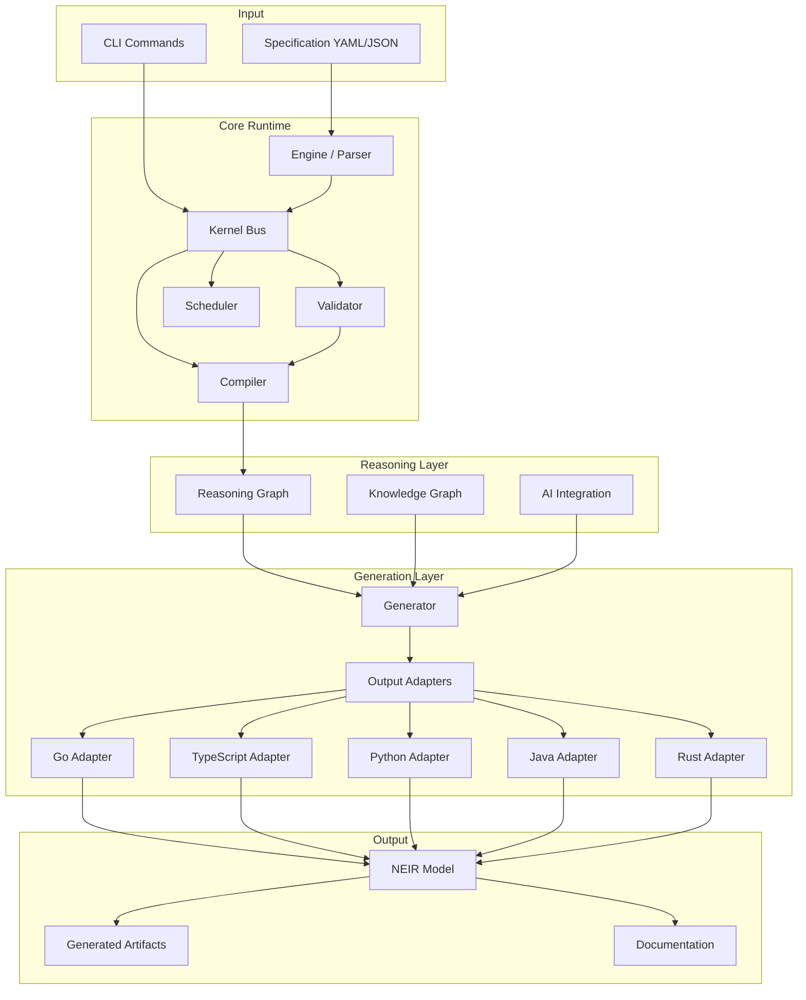
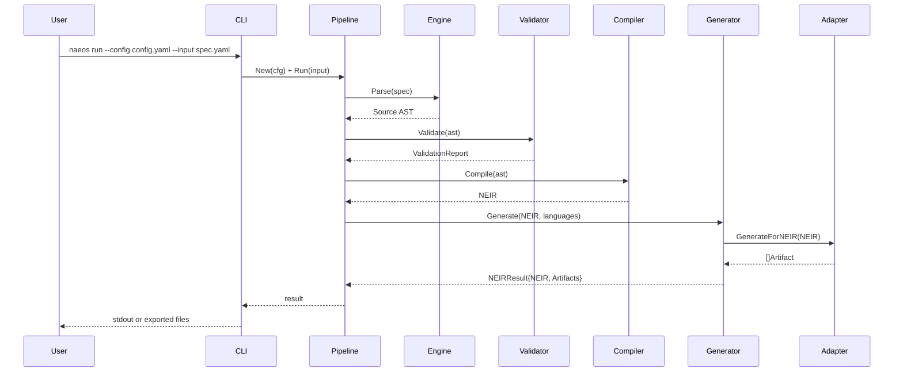
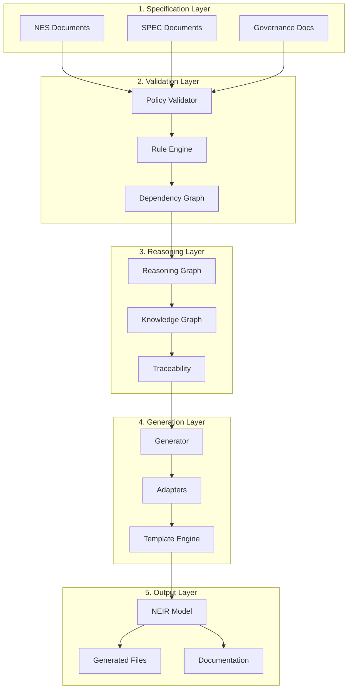
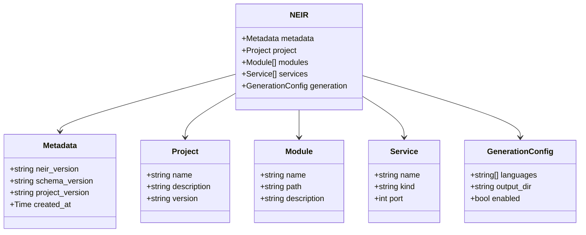

# Architecture Overview

This document provides a high-level conceptual architecture of NAEOS.

## System Architecture



## Data Flow



## Layered Architecture



## NEIR Model Structure



## Purpose

NAEOS is designed to connect four major layers:

1. **Governance** — establishes organizational rules and processes.
2. **Specification** — defines requirements, design, and contracts.
3. **Constitution** — holds normative principles that cannot be violated.
4. **Policy Compiler** — transforms policies into executable rules.

## Conceptual Flow

Requirements and intents enter the specification layer.
After that, policies and governance are mapped to rules that can be validated.
The final output is implementation artifacts, documentation, and consistent execution rules.

## Main Components

- **Governance layer**: organizational rules, standards, and processes
- **Specification layer**: NES and SPEC documents defining system behavior
- **Constitution layer**: normative principles enforced by the system
- **Policy layer**: rules compiled from governance and specification
- **Validation and compiler pipeline**: transforms specs into NEIR
- **Output adapters**: generate code in Go, TypeScript, Python, Java, Rust
- **Reasoning graph**: decision traceability and knowledge management

## Design Principles

- Human readable specifications
- Machine readable NEIR output
- Vendor neutral (multi-language, multi-cloud)
- Extensible via adapters and plugins
- Deterministic pipeline execution

## Repository Structure

```text
naeos/
├── cmd/naeos/          # CLI entry point
├── pkg/pipeline/       # Pipeline orchestration
├── internal/
│   ├── neir/           # NEIR model and sub-packages
│   │   ├── model/      # Domain models (ai, api, architecture, ...)
│   │   └── validator/  # Validation engine
│   ├── generation/     # Generation engine and adapters
│   ├── engine/         # Source parsing and compilation
│   ├── kernel/         # Kernel services and event bus
│   └── shared/         # Shared contracts and types
├── specification/      # NES/SPEC documents
├── docs/               # Documentation
└── examples/           # Example specifications
```
