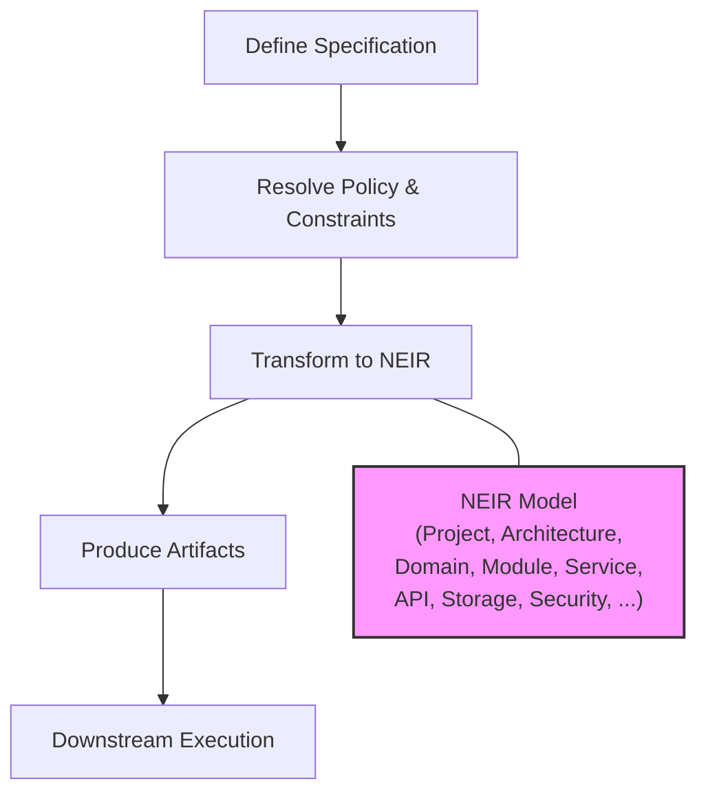

# NES-000 Foundation

## 1. Status
- Status: Draft
- Version: 0.1
- Owner: NAEOS Core Team

## 2. Purpose
This document defines the foundational architectural and philosophical principles of NAEOS as a declarative engineering platform.

## 3. Scope
This specification establishes the mandatory design assumptions for the platform, including the role of specification, provenance, extensibility, and governance.

## 4. Normative References
- NAEOS Constitution
- NAEOS Governance
- NAEOS Specification

## 5. Definitions
- Specification: The authoritative description of intent, structure, and constraints.
- Artifact: Any generated or maintained output derived from the specification.
- Provenance: The lineage and history of an artifact.

## 6. Requirements
### 6.1 Functional Requirements
- FR-001: The platform shall treat specification as the primary source of truth.
- FR-002: The platform shall support deterministic transformation from specification to artifact.
- FR-003: The platform shall preserve traceability between requirement, artifact, and deployment.
- FR-004: The platform shall define a canonical NEIR representation as the central engineering model.
- FR-005: NEIR shall represent Project, Architecture, Domain, Module, Component, Service, API, Storage, Infrastructure, Security, AI, Documentation, Deployment, Testing, and Metadata.
- FR-006: NEIR shall include versioning metadata such as neirVersion, schemaVersion, and projectVersion.

### 6.2 Non-Functional Requirements
- NFR-001: The foundation shall be extensible without modifying the core kernel.
- NFR-002: The foundation shall support auditability and version control for all major artifacts.

## 7. NEIR Model
NEIR is the canonical intermediate representation used by the parser, resolver, planner, generator, validator, and runtime. It is not a syntax tree and not a transport format; it is the complete engineering model of the target system.

## 8. Workflow

1. Define the specification.
2. Resolve the relevant policy and constraints.
3. Transform the specification into a structured NEIR model.
4. Produce validated artifacts for downstream execution.

## 9. Acceptance Criteria
- A new system definition can be represented through a consistent specification model.
- Every generated artifact can be traced back to its originating specification and NEIR node.

## 10. Notes
This document is normative for all downstream NES specifications, including NEIR and planner-related components.
