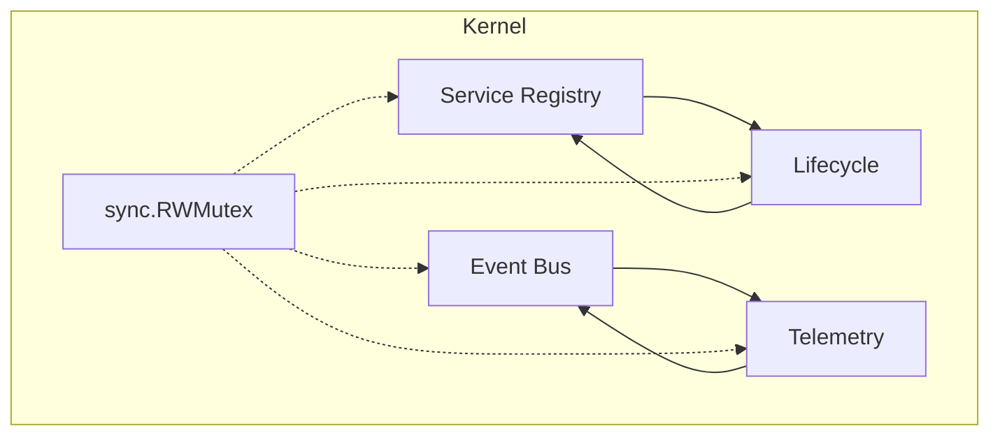
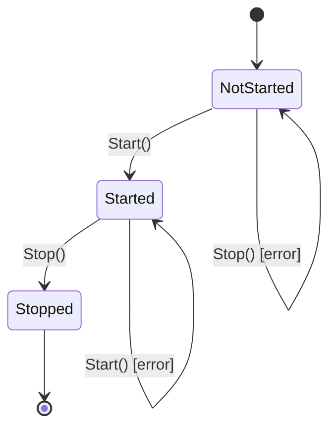

# NES-002 Kernel

## 1. Status
- Status: Draft
- Version: 0.2
- Owner: NAEOS Core Team
- Last Updated: 2026-07-09

## 2. Purpose
This specification defines the core kernel responsibilities required to host NAEOS runtime services. The kernel provides the foundational infrastructure for service registration, lifecycle management, event-driven orchestration, and telemetry collection across the entire NAEOS pipeline.

## 3. Scope
The kernel specification covers:
- Service registry and dependency resolution
- Component lifecycle management (initialize, start, stop)
- Event bus for inter-service publish/subscribe communication
- Telemetry event collection and metrics aggregation
- Thread-safe concurrent access to all kernel primitives

### 3.1 Out of Scope
- Pipeline orchestration logic (NES-026)
- Configuration file parsing (NES-029)
- Specification processing (NES-030)
- Code generation (NES-007)

## 4. Definitions
| Term | Definition |
|------|-----------|
| **Kernel** | The central runtime host that manages service registration, lifecycle, events, and telemetry |
| **Service** | Any component registered with the kernel by name, identified by a unique string key |
| **Lifecycle** | A service that implements the `Lifecycle` interface with Initialize/Start/Stop phases |
| **Topic** | A named event channel used for publish/subscribe communication between services |
| **TelemetryEvent** | An observability event with a name, timestamp, and structured payload |

## 5. Architecture

### 5.1 Component Structure

The kernel is implemented as a single `Kernel` struct in `pkg/kernel/kernel.go` that aggregates four subsystems:



```
┌──────────────────────────────────────────────────┐
│                     Kernel                        │
│                                                   │
│  ┌──────────────┐  ┌──────────────────────────┐  │
│  │ Service       │  │ Event Bus                │  │
│  │ Registry      │  │ - Subscribe(topic, fn)   │  │
│  │ - Register()  │  │ - Publish(topic, payload)│  │
│  │ - Resolve()   │  │ - Topics()               │  │
│  │ - Services()  │  └──────────────────────────┘  │
│  └──────────────┘                                 │
│  ┌──────────────┐  ┌──────────────────────────┐  │
│  │ Lifecycle     │  │ Telemetry                │  │
│  │ - Start()     │  │ - EmitTelemetry(event)   │  │
│  │ - Stop()      │  │ - Metrics()              │  │
│  └──────────────┘  └──────────────────────────┘  │
│                                                   │
│  ┌──────────────────────────────────────────┐    │
│  │ sync.RWMutex (protects all state)         │    │
│  └──────────────────────────────────────────┘    │
└──────────────────────────────────────────────────┘
```

### 5.2 Core Interfaces

#### Lifecycle Interface (`pkg/kernel/lifecycle.go`)
```go
type Lifecycle interface {
    Initialize() error
    Start() error
    Stop() error
}
```

Any service registered with the kernel may optionally implement `Lifecycle`. The kernel will automatically call `Initialize()` then `Start()` during `Kernel.Start()`, and `Stop()` during `Kernel.Stop()`.

#### EventBus Interface (`pkg/kernel/events.go`)
```go
type EventBus interface {
    Publish(topic string, payload any)
    Subscribe(topic string, handler func(any)) error
}
```

The kernel itself implements `EventBus`, allowing any registered service to communicate through named topics.

## 6. Requirements

### 6.1 Functional Requirements
- **FR-001**: The kernel shall maintain a thread-safe service registry that maps string names to service instances.
- **FR-002**: The kernel shall reject duplicate service registrations with an error.
- **FR-003**: The kernel shall reject registration of empty names or nil service instances.
- **FR-004**: The kernel shall resolve a registered service by its string name, returning an error if not found.
- **FR-005**: The kernel shall provide a sorted list of all registered service names via `RegisteredServices()`.
- **FR-006**: The kernel shall call `Initialize()` then `Start()` on all services implementing `Lifecycle` during `Start()`.
- **FR-007**: The kernel shall call `Stop()` on all services implementing `Lifecycle` during `Stop()`.
- **FR-008**: The kernel shall prevent double-start by returning an error if `Start()` is called when already started.
- **FR-009**: The kernel shall prevent stop when not running by returning an error if `Stop()` is called when not started.
- **FR-010**: The kernel shall support publish/subscribe event communication on named topics.
- **FR-011**: The kernel shall support multiple handlers per topic.
- **FR-012**: The kernel shall reject empty topic names and nil handler functions in `Subscribe()`.
- **FR-013**: The kernel shall emit telemetry events with a name, Unix-millisecond timestamp, and structured payload.
- **FR-014**: The kernel shall track cumulative event count and last event in its metrics.

### 6.2 Non-Functional Requirements
- **NFR-001**: All kernel operations shall be safe for concurrent access from multiple goroutines.
- **NFR-002**: The kernel shall use `sync.RWMutex` to allow concurrent reads while serializing writes.
- **NFR-003**: Service resolution and metrics queries shall use read locks; registration and lifecycle changes shall use write locks.
- **NFR-004**: The kernel shall be modular and loosely coupled — it depends only on the `Lifecycle` and `EventBus` interfaces.

## 7. API Reference

### 7.1 Constructor
```go
func NewKernel() *Kernel
```
Returns a new kernel with empty service registry and event subscribers.

### 7.2 Service Registry

| Method | Signature | Description |
|--------|-----------|-------------|
| `Register` | `(name string, service any) error` | Registers a service by name. Fails if name is empty, service is nil, or name is already taken. |
| `Resolve` | `(name string) (any, error)` | Resolves a service by name. Fails if not found. |
| `RegisteredServices` | `() []string` | Returns sorted list of all registered service names. |

### 7.3 Lifecycle

| Method | Signature | Description |
|--------|-----------|-------------|
| `Start` | `() error` | Calls Initialize+Start on all Lifecycle services. Fails if already started. |
| `Stop` | `() error` | Calls Stop on all Lifecycle services. Fails if not started. |

### 7.4 Event Bus

| Method | Signature | Description |
|--------|-----------|-------------|
| `Subscribe` | `(topic string, handler func(any)) error` | Registers a handler for a named topic. |
| `Publish` | `(topic string, payload any)` | Invokes all handlers for a topic with the given payload. |
| `Topics` | `() []string` | Returns sorted list of all topics with active subscribers. |

### 7.5 Telemetry

| Method | Signature | Description |
|--------|-----------|-------------|
| `EmitTelemetry` | `(event TelemetryEvent) error` | Records a telemetry event. Fails if event name is empty. |
| `Metrics` | `() Metrics` | Returns current metrics snapshot (event count + last event). |

## 8. Telemetry Events

The kernel emits the following events during pipeline execution:

| Event Name | When | Payload |
|------------|------|---------|
| `kernel.start` | Kernel begins Start() | `{"services": [registered service names]}` |
| `kernel.stop` | Kernel begins Stop() | `{"services": [registered service names]}` |
| `pipeline.validate` | After validation completes | `{"source_len": input length}` |
| `pipeline.run` | After full pipeline run | `{"artifacts": N, "tasks": N, "reviews": N, "graph_nodes": N, "graph_edges": N}` |

## 9. Workflow



1. **Construction**: `NewKernel()` creates an empty kernel instance.
2. **Registration**: Services are registered via `Register(name, service)` — each service gets a unique string key.
3. **Start**: `Start()` iterates all registered services, calling `Initialize()` then `Start()` on those implementing `Lifecycle`.
4. **Operation**: During pipeline execution, services communicate via `Publish`/`Subscribe` and emit telemetry via `EmitTelemetry`.
5. **Stop**: `Stop()` iterates all registered services in registration order, calling `Stop()` on those implementing `Lifecycle`.
6. **Shutdown**: Kernel state transitions to stopped; further `Stop()` calls return an error.

## 10. Error Handling

| Condition | Error |
|-----------|-------|
| Empty service name | `"service name cannot be empty"` |
| Nil service | `"service cannot be nil"` |
| Duplicate registration | `"service %q already registered"` |
| Service not found | `"service %q not found"` |
| Double start | `"kernel already started"` |
| Stop when not running | `"kernel is not running"` |
| Empty topic name | `"topic cannot be empty"` |
| Nil handler | `"handler cannot be nil"` |
| Empty telemetry event name | `"telemetry event name cannot be empty"` |

## 11. Acceptance Criteria
- **AC-001**: A runtime component can be successfully registered and resolved by the kernel by its string name.
- **AC-002**: The kernel rejects duplicate registrations and returns a descriptive error.
- **AC-003**: Services implementing `Lifecycle` receive Initialize/Start/Stop calls in the correct order.
- **AC-004**: Publish/Subscribe delivers messages to all registered handlers for a given topic.
- **AC-005**: The kernel exposes sufficient telemetry (event count, last event) to diagnose execution errors.
- **AC-006**: All kernel operations are safe under concurrent access from multiple goroutines.

## 12. Implementation References
- `pkg/kernel/kernel.go` — Kernel struct and all method implementations
- `pkg/kernel/lifecycle.go` — Lifecycle interface definition
- `pkg/kernel/events.go` — EventBus interface definition
- `pkg/kernel/telemetry.go` — TelemetryEvent and Metrics structs
- `pkg/pipeline/pipeline.go:145-167` — Kernel service registration in pipeline
- `pkg/pipeline/pipeline.go:169-188` — Kernel lifecycle in pipeline execution
