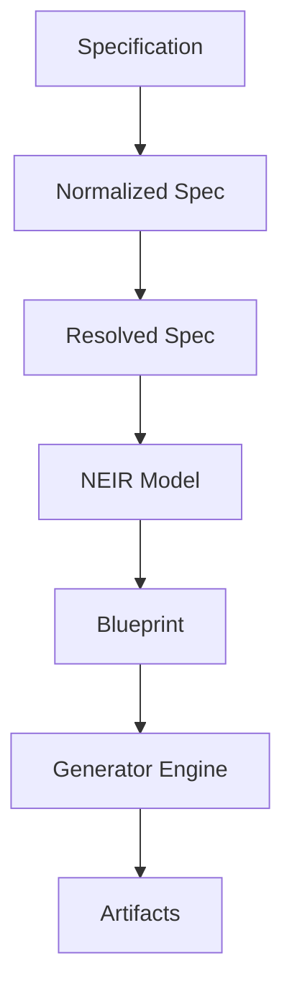
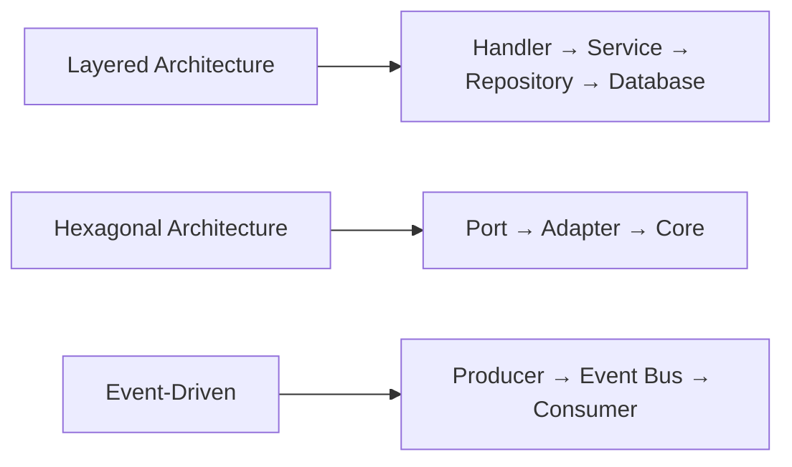

# NES-005 Blueprint

## 1. Status
- Status: Draft
- Version: 0.2
- Owner: NAEOS Core Team

## 2. Purpose
This specification defines the blueprint model — a mid-level design representation that bridges specification and implementation.

## 3. Scope
The blueprint model covers design patterns, component layout, interface contracts, and transformation rules from specification to code.

## 4. Requirements
### 4.1 Functional Requirements
- FR-001: The blueprint shall represent the structural design of modules and services.
- FR-002: The blueprint shall define interface contracts between components.
- FR-003: The blueprint shall support transformation to implementation artifacts.

### 4.2 Non-Functional Requirements
- NFR-001: Blueprints shall be human-readable and machine-parseable.
- NFR-002: Blueprint transformations shall be deterministic.

## 5. Blueprint Model

### 5.1 Relationship to NEIR

The blueprint is a design-time view of the NEIR model. While NEIR captures the complete engineering representation, the blueprint focuses on structural design decisions.



### 5.2 Components

#### Module Blueprint
Defines the internal structure of a module:
- Domain model
- Repository interface
- Service layer
- HTTP handlers
- Middleware
- Configuration
- Tests

#### Service Blueprint
Defines the external interface of a service:
- Endpoints (HTTP/gRPC)
- Port configuration
- Dependencies on modules

#### Architecture Blueprint
Defines cross-cutting concerns:
- Communication patterns (REST, gRPC, events)
- Data flow between modules
- Security boundaries

## 6. Workflow
1. Extract design information from NEIR model.
2. Apply blueprint patterns based on project configuration.
3. Generate intermediate design representation.
4. Feed design to generator engine for artifact production.

## 7. Design Patterns



### 7.1 Layered Architecture
```
Handler → Service → Repository → Database
```

### 7.2 Hexagonal Architecture
```
Port → Adapter → Core
```

### 7.3 Event-Driven
```
Producer → Event Bus → Consumer
```

## 8. Acceptance Criteria
- A blueprint can be generated from a valid NEIR model.
- Blueprint transformations produce consistent implementation artifacts.
- Design patterns are applied based on project configuration.
