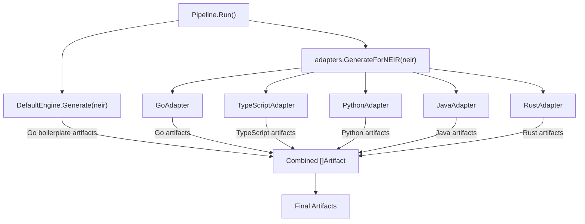

# NES-007 Generator

## 1. Status
- Status: Draft
- Version: 0.2
- Owner: NAEOS Core Team
- Last Updated: 2026-07-09

## 2. Purpose
This specification defines the generator subsystem responsible for transforming the structured NEIR model into implementation artifacts. The generator encompasses both the default engine (producing Go-centric boilerplate) and the adapter-based multi-language generation system (producing language-specific artifacts via registered OutputAdapters).

## 3. Scope
The generator covers:
- Default artifact generation (README, Dockerfile, CI, go.mod, entry points, module/service scaffolding)
- Multi-language adapter-based generation (Go, TypeScript, Python, Java, Rust)
- Output adapter registry and dispatch
- Language-specific project files, Dockerfiles, CI workflows, and module structures
- Template rendering for artifact content

### 3.1 Out of Scope
- Specification parsing and NEIR building (NES-030, NES-023)
- Pipeline orchestration and scheduling (NES-026)
- Artifact review and governance (NES-027)
- Runtime engine and telemetry (NES-032)

## 4. Definitions
| Term | Definition |
|------|-----------|
| **Artifact** | A generated file with a relative path and byte content |
| **OutputAdapter** | A language-specific generator that produces artifacts for a target language |
| **DefaultEngine** | The built-in generator producing Go-centric boilerplate artifacts |
| **NEIR** | Nusantara Enterprise Intermediate Representation — the canonical design model |
| **Language** | A target programming language (go, typescript, python, java, rust) |
| **GenerationConfig** | The NEIR section specifying target languages and output directories |

## 5. Architecture

### 5.1 Generation Flow



```
                    ┌───────────────────────────────────────┐
                    │           Pipeline.Run()               │
                    └───────────────┬───────────────────────┘
                                    │
                    ┌───────────────▼───────────────────────┐
                    │      engine.Generate(neir)             │
                    │      (DefaultEngine — Go boilerplate)  │
                    └───────────────┬───────────────────────┘
                                    │
                    ┌───────────────▼───────────────────────┐
                    │   adapters.GenerateForNEIR(neir)       │
                    │   (dispatches to per-language adapters)│
                    └───────────────┬───────────────────────┘
                                    │
              ┌─────────────────────┼─────────────────────┐
              │                     │                     │
    ┌─────────▼────────┐ ┌─────────▼────────┐ ┌─────────▼────────┐
    │   GoAdapter      │ │ TypeScriptAdapter│ │  PythonAdapter   │
    │   JavaAdapter    │ │   RustAdapter    │ │  (etc.)          │
    └──────────────────┘ └──────────────────┘ └──────────────────┘
              │                     │                     │
              └─────────────────────┼─────────────────────┘
                                    │
                    ┌───────────────▼───────────────────────┐
                    │        []Artifact (combined)           │
                    └───────────────────────────────────────┘
```

### 5.2 Two-Layer Generation

The generator operates in two layers:

1. **Default Engine Layer** (`internal/generation/engine/engine.go`): Always runs. Produces Go-centric boilerplate (README, Dockerfile, CI, go.mod, cmd/app/main.go) plus per-module and per-service artifacts. This layer is language-agnostic for infrastructure files but Go-specific for source code.

2. **Adapter Layer** (`internal/generation/adapters/`): Runs when `neir.Generation.Languages` is set. Dispatches to registered `OutputAdapter` implementations for each target language. Produces language-specific project files, Dockerfiles, CI workflows, and module structures.

Both layers' artifacts are combined into the final output.

## 6. Requirements

### 6.1 Functional Requirements
- **FR-001**: The generator shall consume the canonical NEIR model as its primary input.
- **FR-002**: The generator shall produce artifacts from the supplied NEIR, template, and policy context.
- **FR-003**: The generator shall preserve traceability to the source specification and NEIR elements.
- **FR-004**: The `DefaultEngine.Generate()` method shall produce artifacts for projects, modules, and services described in the NEIR.
- **FR-005**: The `DefaultEngine.Generate()` method shall include README.md, Dockerfile, CI workflow, go.mod, and cmd/app/main.go for every project.
- **FR-006**: The `DefaultEngine.Generate()` method shall produce per-module artifacts: README, package.go, config.yaml, handler.go, repository.go, service.go, domain/model.go, http/handler.go, http/router.go, middleware/logging.go, config/config.go, config/load.go, handler_test.go.
- **FR-007**: The `DefaultEngine.Generate()` method shall produce per-service artifacts: config.yaml and (for HTTP services) server.go and server_test.go.
- **FR-008**: The adapter system shall support registering OutputAdapters via `adapters.Register()` during package init.
- **FR-009**: The adapter system shall dispatch to the correct adapter based on `neir.Generation.Languages`.
- **FR-010**: Each OutputAdapter shall implement the full interface: GenerateProject, GenerateModule, GenerateService, GenerateDockerfile, GenerateCI, GenerateDockerCompose, GenerateArchitectureDoc.
- **FR-011**: The adapter system shall default to Go when no languages are specified in the NEIR.
- **FR-012**: The adapter system shall skip unknown languages silently (no error, no artifacts).
- **FR-013**: The pipeline shall call both `engine.Generate()` and `adapters.GenerateForNEIR()` during `Run()`, combining all artifacts.
- **FR-014**: The pipeline `--language` CLI flag shall override `neir.Generation.Languages` at runtime.

### 6.2 Non-Functional Requirements
- **NFR-001**: Generation shall be deterministic for equivalent inputs — the same NEIR always produces the same artifact set.
- **NFR-002**: Generated artifacts shall be suitable for immediate validation and review without manual restructuring.
- **NFR-003**: Each adapter shall be self-contained in its own file under `internal/generation/adapters/`.
- **NFR-004**: Adapters shall auto-register via Go `init()` functions, requiring no manual registration call.

## 7. OutputAdapter Interface

```go
type OutputAdapter interface {
    Language() language.Language
    GenerateProject(projectName string) []engine.Artifact
    GenerateModule(moduleName, modulePath, projectName string) []engine.Artifact
    GenerateService(serviceName, serviceKind string, servicePort int, projectName string) []engine.Artifact
    GenerateDockerfile(projectName string) []engine.Artifact
    GenerateCI(projectName string) []engine.Artifact
    GenerateDockerCompose(projectName string) []engine.Artifact
    GenerateArchitectureDoc(projectName, pattern string) []engine.Artifact
}
```

### 7.1 Method Descriptions

| Method | Purpose | Typical Output |
|--------|---------|----------------|
| `Language()` | Returns the target language identifier | `language.LanguageGo`, `language.LanguageTypeScript`, etc. |
| `GenerateProject()` | Creates project-level files | Build file (go.mod, package.json, pyproject.toml, pom.xml, Cargo.toml) + entry point |
| `GenerateModule()` | Creates module-level source files | Source files with language-appropriate package/namespace structure |
| `GenerateService()` | Creates service-level files | Server implementation with HTTP handler, routes, config |
| `GenerateDockerfile()` | Creates container build file | Language-specific Dockerfile with appropriate base image |
| `GenerateCI()` | Creates CI workflow file | GitHub Actions workflow with language-specific setup step |
| `GenerateDockerCompose()` | Creates compose file | docker-compose.yml for multi-service orchestration |
| `GenerateArchitectureDoc()` | Creates architecture documentation | Markdown document describing the architectural pattern |

## 8. Adapter Registry

The adapter registry is a package-level map in `internal/generation/adapters/adapter.go`:

```go
var adapters = map[language.Language]OutputAdapter{}

func Register(adapter OutputAdapter) {
    adapters[adapter.Language()] = adapter
}

func Get(lang language.Language) (OutputAdapter, bool) {
    a, ok := adapters[lang]
    return a, ok
}

func All() map[language.Language]OutputAdapter { ... }
```

### 8.1 Registered Adapters

| Adapter | Language | File | Build File |
|---------|----------|------|-----------|
| `GoAdapter` | go | `adapters/go.go` | `go.mod` |
| `TypeScriptAdapter` | typescript | `adapters/typescript.go` | `package.json` |
| `PythonAdapter` | python | `adapters/python.go` | `pyproject.toml` |
| `JavaAdapter` | java | `adapters/java.go` | `pom.xml` |
| `RustAdapter` | rust | `adapters/rust.go` | `Cargo.toml` |

All adapters auto-register via `init()` when the `adapters` package is imported.

## 9. Artifact Naming Conventions

### 9.1 Default Engine Artifacts
| Artifact | Path Pattern |
|----------|-------------|
| README | `README.md` |
| Dockerfile | `Dockerfile` |
| CI workflow | `.github/workflows/ci.yml` |
| Go module | `go.mod` |
| Entry point | `cmd/app/main.go` |
| Module README | `<module_path>/README.md` |
| Module package | `<module_path>/package.go` |
| Module handler | `<module_path>/handler.go` |
| Module test | `<module_path>/handler_test.go` |
| Service config | `internal/<service_name>/config.yaml` |
| Service server | `internal/<service_name>/server.go` |

### 9.2 Adapter Artifacts (Go example)
| Artifact | Path Pattern |
|----------|-------------|
| Go module | `go.mod` |
| Module package | `<module_path>/<package_name>.go` |
| Module handler | `<module_path>/handler.go` |
| Module service | `<module_path>/service.go` |
| Module repository | `<module_path>/repository.go` |
| Module domain | `<module_path>/domain/model.go` |
| Module HTTP | `<module_path>/http/handler.go` |
| Module middleware | `<module_path>/middleware/logging.go` |
| Module config | `<module_path>/config/config.go` |
| Module test | `<module_path>/handler_test.go` |
| Service server | `internal/<service_name>/server.go` |

## 10. Language-Specific Details

### 10.1 Go
- **Base image**: `golang:1.22-alpine`
- **Runtime image**: `alpine:3.19`
- **Build file**: `go.mod`
- **Package convention**: lowercase package names matching directory

### 10.2 TypeScript
- **Base image**: `node:22-alpine`
- **Runtime image**: `node:22-alpine`
- **Build file**: `package.json`
- **Extensions**: `.ts`, `.tsx`, `.js`, `.json`

### 10.3 Python
- **Base image**: `python:3.12-slim`
- **Runtime image**: `python:3.12-slim`
- **Build file**: `pyproject.toml`
- **Extensions**: `.py`, `.toml`, `.cfg`

### 10.4 Java
- **Base image**: `eclipse-temurin:21-jdk-alpine`
- **Runtime image**: `eclipse-temurin:21-jre-alpine`
- **Build file**: `pom.xml`
- **Extensions**: `.java`, `.xml`, `.gradle`

### 10.5 Rust
- **Base image**: `rust:1.78-alpine`
- **Runtime image**: `alpine:3.19`
- **Build file**: `Cargo.toml`
- **Extensions**: `.rs`, `.toml`

## 11. Workflow

1. **Receive NEIR**: Pipeline passes the validated NEIR model to the generator.
2. **Default generation**: `engine.Generate(neir)` produces Go-centric boilerplate and per-module/service scaffolding.
3. **Adapter resolution**: `adapters.GenerateForNEIR(neir)` reads `neir.Generation.Languages` (or defaults to Go).
4. **Per-language dispatch**: For each resolved language, the registry looks up the matching `OutputAdapter`.
5. **Artifact generation**: The adapter's methods are called for each project, module, and service in the NEIR.
6. **Artifact combination**: All artifacts from both layers are combined into the final output list.
7. **Review**: Artifacts are passed to the reviewer for TODO/placeholder checks.
8. **Output**: Artifacts are optionally written to the output directory.

## 12. Error Handling

| Condition | Behavior |
|-----------|----------|
| NEIR is nil | Return nil, no error |
| Unknown language in Generation.Languages | Skip silently, no artifacts for that language |
| No adapters registered | No adapter artifacts, only default engine output |
| Engine Generate() with nil NEIR | Return error "neir is nil" |
| GenerateForLanguage() with invalid language | Return error "unsupported language: %s" |

## 13. Acceptance Criteria
- **AC-001**: The generator produces consistent artifacts for identical input NEIR models.
- **AC-002**: Generated artifacts can be validated without manual restructuring.
- **AC-003**: The default engine always produces Go boilerplate regardless of configured languages.
- **AC-004**: Specifying `--language typescript` produces TypeScript-specific artifacts alongside Go boilerplate.
- **AC-005**: Specifying multiple languages (e.g., `--language go --language python`) produces artifacts for all specified languages.
- **AC-006**: Unknown languages in the configuration are silently skipped without errors.
- **AC-007**: Each adapter produces valid, compilable code for its target language.
- **AC-008**: The adapter registry correctly dispatches to the appropriate adapter based on language.

## 14. Implementation References
- `internal/generation/engine/engine.go` — DefaultEngine with Generate() and GenerateForLanguage()
- `internal/generation/adapters/adapter.go` — OutputAdapter interface, registry, GenerateForNEIR()
- `internal/generation/adapters/go.go` — GoAdapter implementation
- `internal/generation/adapters/typescript.go` — TypeScriptAdapter implementation
- `internal/generation/adapters/python.go` — PythonAdapter implementation
- `internal/generation/adapters/java.go` — JavaAdapter implementation
- `internal/generation/adapters/rust.go` — RustAdapter implementation
- `internal/generation/renderers/renderer.go` — Template rendering for artifact content
- `internal/neir/model/language/language.go` — Language type, validity checks, extensions, Docker images
- `internal/neir/model/generation/generation.go` — GenerationConfig struct
- `pkg/pipeline/pipeline.go:307-370` — Pipeline.Run() calling both generators
