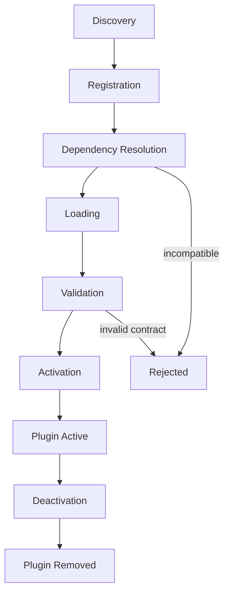

# NES-009 Plugin

## 1. Status
- Status: Draft
- Version: 0.2
- Owner: NAEOS Core Team

## 2. Purpose
This specification defines the extension model for adding capabilities to NAEOS without modifying the core kernel.

## 3. Scope
The plugin model covers discovery, registration, dependency resolution, contract validation, and runtime isolation.

## 4. Requirements
### 4.1 Functional Requirements
- FR-001: The platform shall support discovery and loading of plugins.
- FR-002: The platform shall validate plugin contract compatibility before activation.
- FR-003: Plugins shall implement the `contracts.Contract` interface for self-validation.
- FR-004: Plugins shall be registered in the component registry.

### 4.2 Non-Functional Requirements
- NFR-001: Plugins shall be isolated from core services.
- NFR-002: Plugin lifecycle shall be observable and reversible.
- NFR-003: Plugin loading shall not affect core kernel stability.

## 5. Plugin Model

### 5.1 Plugin Contract

```go
type Plugin interface {
    contracts.Contract
    contracts.Versioned
    contracts.Named
    Name() string
    Version() string
    Validate() error
}
```

### 5.2 Plugin Lifecycle



```
Discovery → Registration → Dependency Resolution → Loading → Validation → Activation
    ↓                                                                              ↓
    └── Reject (if incompatible)                                    Deactivation (if needed)
```

### 5.3 Plugin Types

#### Generator Plugin
Menambahkan kemampuan generate artefak baru (bahasa target baru, format output baru).

#### Validator Plugin
Menambahkan aturan validasi baru untuk spesifikasi atau artefak.

#### Policy Plugin
Menambahkan aturan governance baru untuk evaluasi policy.

#### Renderer Plugin
Menambahkan engine rendering template baru.

## 6. Workflow
1. **Discover** a plugin from registry or local path.
2. **Register** plugin metadata and capability in the component registry.
3. **Resolve** dependencies and compatibility.
4. **Load** the plugin into the target pipeline.
5. **Validate** health and contract compliance via `Validate()`.
6. **Activate** the plugin for use in pipeline operations.

## 7. Integration with Kernel

Plugins berinteraksi dengan kernel melalui:
- **Service Registry** — pendaftaran service yang disediakan plugin.
- **Event Bus** — penerimaan event dari komponen lain.
- **Lifecycle** — partisipasi dalam start/stop sequence.

## 8. Safety Mechanisms

- Plugin harus melewati validasi kontrak sebelum diaktifkan.
- Plugin yang gagal validasi ditolak tanpa mempengaruhi komponen lain.
- Plugin dapat dinonaktifkan tanpa restart kernel.

## 9. Acceptance Criteria
- A plugin can be installed and activated without altering the core kernel.
- Invalid or incompatible plugins are rejected safely.
- Plugin lifecycle is observable through kernel telemetry.
