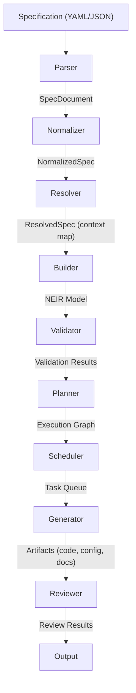

# NES-013 Compiler

## 1. Status
- Status: Draft
- Version: 0.2
- Owner: NAEOS Core Team

## 2. Purpose
This specification defines the compiler subsystem responsible for transforming a structured NEIR model into executable or deployable artifacts.

## 3. Scope
The compiler covers parsing, semantic binding, transformation, optimization, and emission of outputs.

## 4. Requirements
### 4.1 Functional Requirements
- FR-001: The compiler shall parse source specifications into an internal representation and resolve them into NEIR.
- FR-002: The compiler shall apply rules, policies, and profile constraints during transformation.
- FR-003: The compiler shall preserve provenance of transformed artifacts.
- FR-004: The compiler shall support multiple output formats (Go, Docker, CI/CD, documentation).

### 4.2 Non-Functional Requirements
- NFR-001: Compilation shall be deterministic for equivalent inputs.
- NFR-002: The compiler shall emit artifacts suitable for downstream validation.

## 5. Compiler Pipeline



```
Specification (YAML/JSON)
    ↓
┌─────────────┐
│   Parser    │  → SpecDocument
└─────────────┘
    ↓
┌─────────────┐
│  Normalizer │  → NormalizedSpec
└─────────────┘
    ↓
┌─────────────┐
│  Resolver   │  → ResolvedSpec (context map)
└─────────────┘
    ↓
┌─────────────┐
│   Builder   │  → NEIR Model
└─────────────┘
    ↓
┌─────────────┐
│  Validator  │  → Validation Results
└─────────────┘
    ↓
┌─────────────┐
│  Planner    │  → Execution Graph
└─────────────┘
    ↓
┌─────────────┐
│  Scheduler  │  → Task Queue
└─────────────┘
    ↓
┌─────────────┐
│  Generator  │  → Artifacts (code, config, docs)
└─────────────┘
    ↓
┌─────────────┐
│  Reviewer   │  → Review Results
└─────────────┘
```

## 6. Pipeline Stages

### 6.1 Parser
Membaca YAML/JSON specification dan menghasilkan `SpecDocument`.

### 6.2 Normalizer
Menormalkan `SpecDocument` menjadi format kanonik `NormalizedSpec`.

### 6.3 Resolver
Mereshol normalized spec menjadi `ResolvedSpec` (context map) dengan semua dependensi.

### 6.4 Builder
Membangun model `NEIR` dari resolved spec.

### 6.5 Validator
Memvalidasi NEIR: project exists, modules valid, services valid, tidak ada duplikasi.

### 6.6 Planner
Membangun execution graph (DAG) dari NEIR untuk menentukan urutan eksekusi.

### 6.7 Scheduler
Mengubah execution graph menjadi antrian task yang dapat dieksekusi.

### 6.8 Generator
Menghasilkan artefak output: kode, konfigurasi, dokumentasi, CI/CD workflows.

### 6.9 Reviewer
Mengevaluasi artefak terhadap aturan governance (no-todo, no-placeholder, license header).

## 7. Public API

Pipeline orchestrator tersedia di `pkg/pipeline`:

```go
p := pipeline.NewPipeline(config)

// Full run
results, err := p.Run("specification.yaml")

// Validate only
results, err = p.Validate("specification.yaml")
```

## 8. Acceptance Criteria
- The compiler produces a consistent artifact for the same specification input.
- The compiled artifact is suitable for downstream validation or deployment.
- All pipeline stages are executed in correct dependency order.
- Provenance is tracked for every generated artifact.
