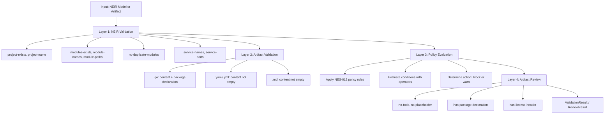

# NES-014 Validator

## 1. Status
- Status: Draft
- Version: 0.2
- Owner: NAEOS Core Team

## 2. Purpose
This specification defines the validator subsystem responsible for quality checks and consistency verification across NAEOS artifacts.

## 3. Scope
The validator covers NEIR validation, artifact validation, policy evaluation, and review enforcement.

## 4. Requirements
### 4.1 Functional Requirements
- FR-001: The validator shall check NEIR model integrity (project exists, modules valid, services valid).
- FR-002: The validator shall enforce governance rules on generated artifacts.
- FR-003: The validator shall provide clear error messages for failed validations.
- FR-004: The validator shall support per-file-type validation (Go, YAML, Markdown).

### 4.2 Non-Functional Requirements
- NFR-001: Validation shall be deterministic for equivalent inputs.
- NFR-002: Validation results shall be auditable.

## 5. Validation Layers



### 5.1 NEIR Validation

Memvalidasi model NEIR setelah dibangun:

| Check | Deskripsi |
|-------|-----------|
| project-exists | Project field harus ada |
| project-name | Project harus punya nama |
| modules-exists | Minimal satu modul |
| module-names | Setiap modul harus punya nama |
| module-paths | Setiap modul harus punya path |
| no-duplicate-modules | Tidak ada modul duplikat |
| service-names | Setiap service harus punya nama |
| service-ports | Port harus dalam range 0-65535 |

### 5.2 Artifact Validation

Validasi per tipe file:

| Ext | Rules |
|-----|-------|
| `.go` | Content tidak kosong, punya deklarasi `package` |
| `.yaml`/`.yml` | Content tidak kosong |
| `.md` | Content tidak kosong |

### 5.3 Policy Evaluation

Evaluasi terhadap policy rules (lihat NES-012).

### 5.4 Artifact Review

Review artefak terhadap aturan governance:

| Rule | Deskripsi |
|------|-----------|
| no-todo | Tidak ada komentar TODO |
| no-placeholder | Tidak ada placeholder text |
| has-package-declaration | File Go punya deklarasi package |
| has-license-header | File punya header lisensi |

## 6. Review Status

| Status | Deskripsi |
|--------|-----------|
| approved | Lolos semua pemeriksaan |
| rejected | Gagal salah satu pemeriksaan kritis |
| pending | Belum dievaluasi |
| changes_requested | Perlu perubahan sebelum disetujui |

## 7. Workflow
1. Terima NEIR model atau artefak untuk divalidasi.
2. Jalankan validasi sesuai tipe (NEIR, artifact, policy, review).
3. Kumpulkan hasil validasi (errors, warnings).
4. Kembalikan `ValidationResult` atau `ReviewResult`.

## 8. Usage Example

```go
// NEIR validation
result := validator.Validate(neirModel)
if !result.Valid {
    for _, err := range result.Errors {
        fmt.Printf("Error %s: %s\n", err.Code, err.Message)
    }
}

// Artifact review
review := reviewer.Review(artifact)
fmt.Printf("Status: %s\n", review.Status)
```

## 9. Acceptance Criteria
- NEIR validation catches all structural errors.
- Artifact validation checks content completeness.
- Policy evaluation is deterministic and auditable.
- Review results provide actionable feedback.
