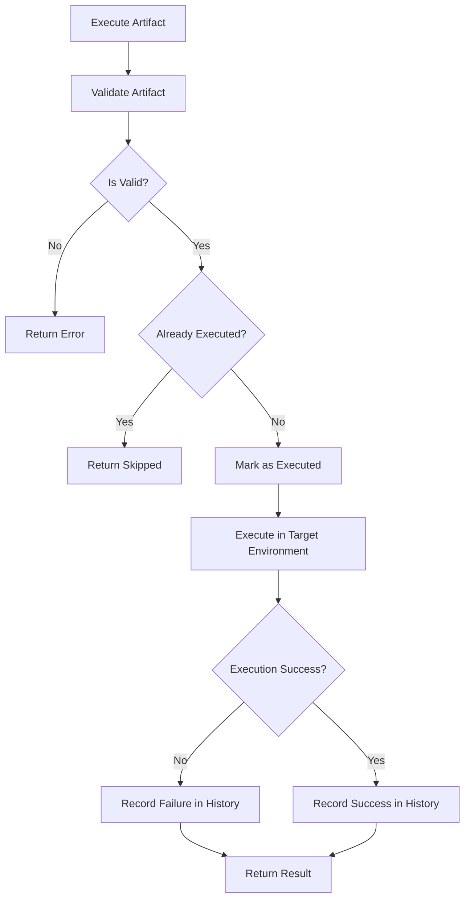
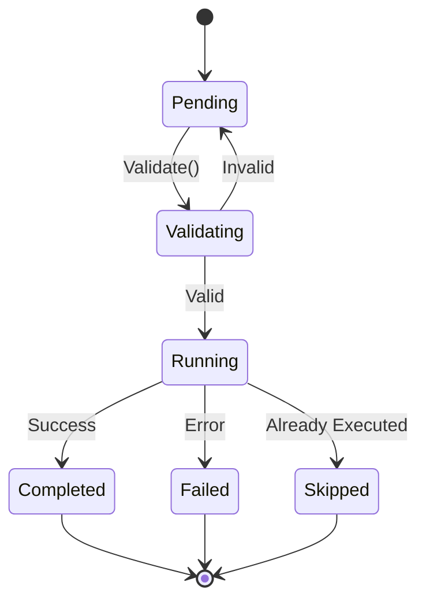

# NES-015 Runtime

## 1. Status
- Status: Draft
- Version: 0.2
- Owner: NAEOS Core Team

## 2. Purpose
This specification defines the runtime layer responsible for executing generated artifacts in the target environment while preserving the lineage to NEIR.

## 3. Scope
The runtime covers execution lifecycle, runtime state, logging, observability, error handling, and recovery.

## 4. Requirements
### 4.1 Functional Requirements
- FR-001: The runtime shall execute valid artifacts in the target environment.
- FR-002: The runtime shall expose execution status and diagnostics.
- FR-003: The runtime shall maintain a traceable association between executed artifacts and their originating NEIR model.
- FR-004: The runtime shall track execution history.
- FR-005: The runtime shall deduplicate artifact execution.

### 4.2 Non-Functional Requirements
- NFR-001: The runtime shall be observable and auditable.
- NFR-002: The runtime shall support controlled recovery from execution faults.
- NFR-003: Runtime operations shall be thread-safe.

## 5. Runtime Model

### 5.1 Architecture

```
RuntimeEngine
├── history: []ExecutionResult
├── executed: map[string]bool
└── mu: sync.Mutex
```

### 5.2 Types

#### Artifact

```go
type Artifact struct {
    Path    string
    Content []byte
}
```

#### ExecutionResult

```go
type ExecutionResult struct {
    Artifact Artifact
    Status   string    // "completed" | "skipped" | "failed"
    Output   string
    Error    error
}
```

### 5.3 Interface

```go
type RuntimeEngine interface {
    Run(artifact any) error
    Execute(artifact Artifact) (*ExecutionResult, error)
    ExecuteAll(artifacts []Artifact) ([]ExecutionResult, error)
    Validate(artifact Artifact) error
}
```

### 5.4 Constructor

```go
func NewEngine() RuntimeEngine
```

### 5.5 Runtime Execution Flow



### 5.6 Artifact Execution States



## 6. Operations

### 6.1 Execute

1. Validasi artifact path tidak kosong.
2. Validasi artifact berdasarkan tipe file.
3. Cek apakah artifact sudah dieksekusi (deduplication).
4. Jika sudah, kembalikan status "skipped".
5. Jika belum, tandai sebagai executed, catat di history.

### 6.2 ExecuteAll

Menjalankan beberapa artifact secara sequential. Berhenti pada error pertama.

### 6.3 Validate

Validasi artifact berdasarkan extension:

| Extension | Rules |
|-----------|-------|
| `.go` | Content tidak kosong, punya `package` declaration |
| `.yaml`/`.yml` | Content tidak kosong |
| `.md` | Content tidak kosong |

### 6.4 History & Stats

```go
func (e *DefaultRuntimeEngine) History() []ExecutionResult
func (e *DefaultRuntimeEngine) Reset()
func (e *DefaultRuntimeEngine) ExecutedCount() int
func (e *DefaultRuntimeEngine) FailedCount() int
```

## 7. Workflow
1. **Initialize** the runtime context.
2. **Load** the artifact to be executed.
3. **Validate** the artifact (per-file-type checks).
4. **Execute** the artifact (mark as executed, record in history).
5. **Report** outcomes and faults.

## 8. Usage Example

```go
engine := runtime.NewEngine()

result, err := engine.Execute(artifact{
    Path:    "cmd/main.go",
    Content: []byte("package main\n\nfunc main() {}"),
})

// Check history
history := engine.History()
fmt.Printf("Executed: %d, Failed: %d\n",
    engine.ExecutedCount(), engine.FailedCount())
```

## 9. Acceptance Criteria
- An artifact can be executed by the runtime without manual intervention.
- Runtime failures are reported with sufficient detail for remediation.
- Duplicate executions are detected and skipped.
- Execution history is maintained and queryable.
