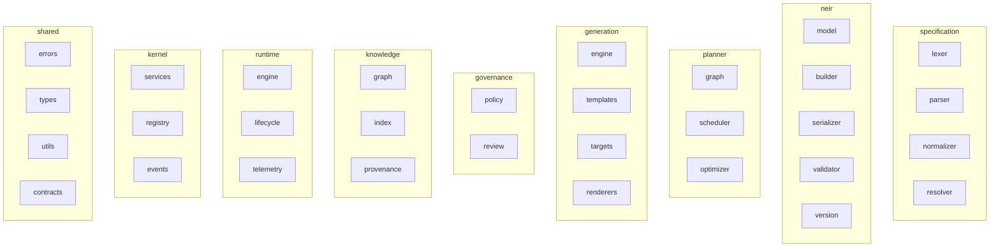

# NES-024 Internal Structure Draft

## 1. Status
- Status: Draft
- Version: 0.1
- Owner: NAEOS Core Team

## 2. Purpose
This document provides a detailed draft of the internal repository structure for the implementation phase of NAEOS.

## 3. Scope
This draft defines the proposed layout of internal packages and folders that will host the parser, resolver, NEIR model, planner, generator, governance, knowledge, runtime, kernel, and shared utilities.

## 4. Proposed Directory Structure



```text
internal/
├── specification/
│   ├── lexer/
│   │   └── token.go
│   ├── parser/
│   │   └── parser.go
│   ├── normalizer/
│   │   └── normalizer.go
│   └── resolver/
│       └── resolver.go
├── neir/
│   ├── model/
│   │   ├── project/
│   │   │   └── project.go
│   │   ├── architecture/
│   │   │   └── architecture.go
│   │   ├── domain/
│   │   │   └── domain.go
│   │   ├── module/
│   │   │   └── module.go
│   │   ├── component/
│   │   │   └── component.go
│   │   ├── service/
│   │   │   └── service.go
│   │   ├── api/
│   │   │   └── api.go
│   │   ├── storage/
│   │   │   └── storage.go
│   │   ├── infrastructure/
│   │   │   └── infrastructure.go
│   │   ├── security/
│   │   │   └── security.go
│   │   ├── ai/
│   │   │   └── ai.go
│   │   ├── documentation/
│   │   │   └── documentation.go
│   │   ├── deployment/
│   │   │   └── deployment.go
│   │   ├── testing/
│   │   │   └── testing.go
│   │   └── metadata/
│   │       └── metadata.go
│   ├── builder/
│   │   └── builder.go
│   ├── serializer/
│   │   └── serializer.go
│   ├── validator/
│   │   └── validator.go
│   └── version/
│       └── version.go
├── planner/
│   ├── graph/
│   │   └── graph.go
│   ├── scheduler/
│   │   └── scheduler.go
│   └── optimizer/
│       └── optimizer.go
├── generation/
│   ├── engine/
│   │   └── engine.go
│   ├── templates/
│   │   └── registry.go
│   ├── targets/
│   │   └── targets.go
│   └── renderers/
│       └── renderer.go
├── governance/
│   ├── policy/
│   │   └── evaluator.go
│   └── review/
│       └── reviewer.go
├── knowledge/
│   ├── graph/
│   │   └── graph.go
│   ├── index/
│   │   └── index.go
│   └── provenance/
│       └── provenance.go
├── runtime/
│   ├── engine/
│   │   └── engine.go
│   ├── lifecycle/
│   │   └── lifecycle.go
│   └── telemetry/
│       └── telemetry.go
├── kernel/
│   ├── services/
│   │   └── service.go
│   ├── registry/
│   │   └── registry.go
│   └── events/
│       └── events.go
└── shared/
    ├── errors/
    │   └── errors.go
    ├── types/
    │   └── types.go
    ├── utils/
    │   └── utils.go
    └── contracts/
        └── contracts.go
```

## 5. Responsibilities by Area

### 5.1 specification/
Responsible for lexical analysis, parsing, normalization, and resolution of source specifications into structured input.

### 5.2 neir/
Responsible for representing the canonical engineering model and its transformation, serialization, validation, and versioning.

### 5.3 planner/
Responsible for constructing execution graphs, scheduling generation tasks, and optimizing the plan based on dependencies and constraints.

### 5.4 generation/
Responsible for converting NEIR into concrete artifacts such as code, documentation, configuration, Docker assets, and CI/CD workflows.

### 5.5 governance/
Responsible for policy enforcement and review workflows.

### 5.6 knowledge/
Responsible for maintaining knowledge graphs, indexing context, and preserving provenance.

### 5.7 runtime/
Responsible for execution lifecycle management and telemetry instrumentation.

### 5.8 kernel/
Responsible for fundamental runtime services such as service registry, lifecycle events, and dependency coordination.

### 5.9 shared/
Responsible for common utilities, contracts, and shared types reused across packages.

## 6. Implementation Notes
- This structure is intended as a draft and may evolve as the platform matures.
- Each package should expose clear interfaces and remain loosely coupled.
- The NEIR package should remain the central abstraction used by planner, generator, validator, and runtime.

## 7. Acceptance Criteria
- The repository structure clearly separates parsing, modeling, planning, generation, governance, and runtime concerns.
- Developers can locate implementation modules without ambiguity.
- The structure supports future extension to multiple generators and runtimes.
