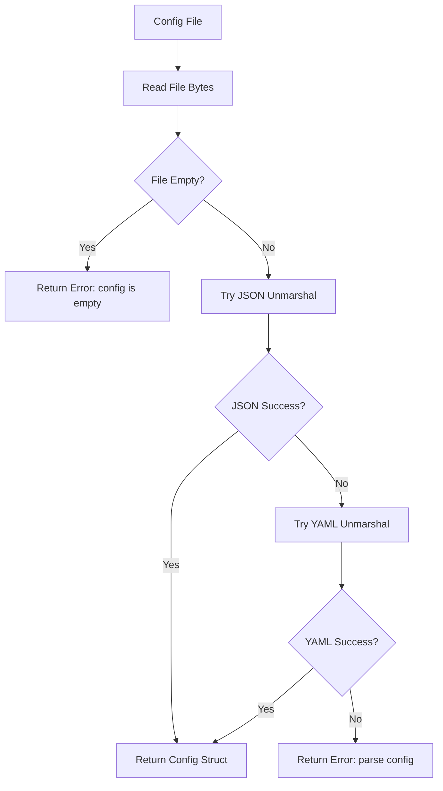

# NES-029 — Configuration Reference

> Status: Draft
> Last Updated: 2026-07-10

Complete reference for NAEOS configuration files.

---

## File Formats

NAEOS supports both JSON and YAML configuration files. The parser attempts JSON first, then falls back to YAML.

### JSON

```json
{
  "pipeline": {
    "name": "my-project",
    "mode": "development",
    "verbose": true,
    "output_dir": "./out"
  }
}
```

### YAML

```yaml
pipeline:
  name: my-project
  mode: development
  verbose: true
  output_dir: ./out
```

---

## Configuration Structure

### Top Level

| Field | Type | Description |
|---|---|---|
| `pipeline` | `Pipeline` | Pipeline configuration block |

### Pipeline

| Field | Type | Default | Description |
|---|---|---|---|
| `name` | `string` | `"naeos-dev"` | Pipeline name identifier |
| `mode` | `string` | `"development"` | Execution mode |
| `verbose` | `bool` | `false` | Enable verbose logging |
| `output_dir` | `string` | `"./out"` | Directory for generated artifacts |

---

## Pipeline Modes

| Mode | Description |
|---|---|
| `development` | Local development with verbose output |
| `production` | Production builds with minimal logging |
| `testing` | Test mode with validation focus |
| `ci` | Continuous integration mode |

---

## Config Loading

### From File

```go
cfg, err := config.LoadFile("config.yaml")
```



The loader:
1. Reads the file bytes
2. Tries JSON unmarshal
3. Falls back to YAML unmarshal
4. Returns error if both fail

### Error Handling

| Error | Condition |
|---|---|
| `read config: <os error>` | File read failed |
| `config is empty` | File is 0 bytes |
| `parse config: <yaml error>` | Both JSON and YAML failed |

---

## Pipeline Runtime Config

The `pipeline.Config` struct extends file config with component injection:

| Field | Type | Default | Description |
|---|---|---|---|
| `Name` | `string` | From file | Pipeline name |
| `Mode` | `string` | From file | Execution mode |
| `Verbose` | `bool` | From file | Verbose flag |
| `OutputDir` | `string` | From file | Output directory |
| `Parser` | `parser.Parser` | `parser.NewParser()` | Spec parser |
| `Normalizer` | `normalizer.Normalizer` | `normalizer.NewNormalizer()` | Spec normalizer |
| `Resolver` | `resolver.Resolver` | `resolver.NewResolver()` | Context resolver |
| `Builder` | `builder.Builder` | `builder.NewBuilder()` | NEIR builder |
| `Validator` | `validator.Validator` | `validator.NewValidator()` | NEIR validator |
| `Scheduler` | `scheduler.Scheduler` | `scheduler.NewScheduler()` | Task scheduler |
| `Generator` | `engine.GeneratorEngine` | `engine.NewEngine()` | Artifact generator |
| `Graph` | `*graph.PlannerGraph` | `graph.New()` | Dependency graph |
| `Registry` | `*registry.Registry` | `registry.NewRegistry()` | Component registry |
| `Evaluator` | `policy.Evaluator` | `policy.NewEvaluator()` | Policy evaluator |
| `Reviewer` | `review.Reviewer` | `review.NewReviewer()` | Artifact reviewer |
| `Kernel` | `*kernel.Kernel` | `kernel.NewKernel()` | Service kernel |
| `Policies` | `[]policy.Rule` | `nil` | Policy rules |

---

## Component Injection

Override default components by setting fields on `pipeline.Config`:

```go
cfg := pipeline.Config{
    Name:    "my-pipeline",
    Mode:    "development",
    Parser:  myCustomParser,
    Reviewer: myCustomReviewer,
}
p := pipeline.New(cfg)
```

---

## Validation Rules

| Rule | Error |
|---|---|
| Config file is empty | `"config is empty"` |
| File is not valid JSON or YAML | `"parse config: <error>"` |
| `--config` flag is missing | `"missing required --config"` |
| Both `--input` and `--input-file` set | Mutually exclusive |
| Neither `--input` nor `--input-file` | One is required |

---

## Example Configs

### Minimal

```yaml
pipeline:
  name: demo
  mode: development
```

### Full

```yaml
pipeline:
  name: production-app
  mode: production
  verbose: false
  output_dir: ./build/artifacts
```

### JSON Minimal

```json
{
  "pipeline": {
    "name": "demo"
  }
}
```
