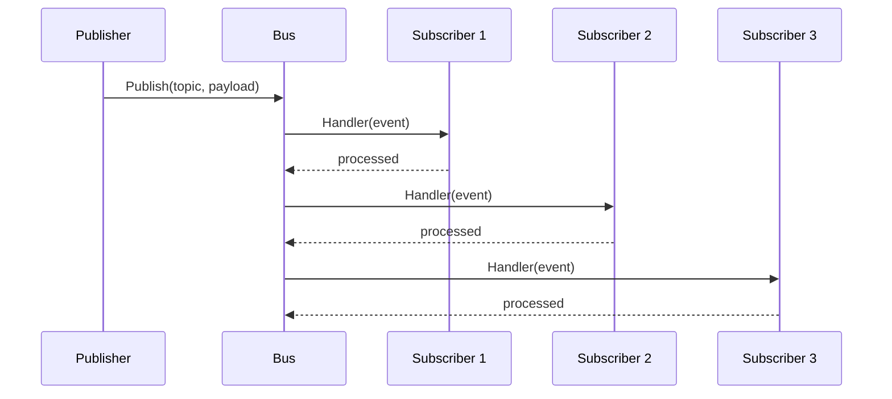

# NES-034 Event Bus

## 1. Status
- Status: Draft
- Version: 0.1
- Owner: NAEOS Core Team

## 2. Purpose
Dokumentasi referensi untuk package `internal/events` — implementasi internal event bus (pub/sub) yang digunakan untuk komunikasi antar komponen dalam pipeline NAEOS.

## 3. Scope
Dokumen ini mencakup definisi tipe data, interface, implementasi, dan contoh penggunaan event bus internal.

## 4. Normative References
- NES-002 Kernel — service primitive dan lifecycle
- NES-026 Pipeline — orkestrasi pipeline

## 5. Architecture

Event bus internal menyediakan mekanisme pub/sub berbasis topik untuk komunikasi antar komponen.



```
Publisher -> Bus.Publish(topic, payload)
                |
                v
        subscribers[topic]
                |
                v
        Handler(event)
```

## 6. Types

### 6.1 Event

```go
type Event struct {
    Topic   string
    Payload any
}
```

Field | Tipe | Deskripsi
------|------|----------
Topic | string | Topik pesan
Payload | any | Data yang dikirim

### 6.2 Handler

```go
type Handler func(event Event)
```

Fungsi callback yang dipanggil saat event diterima pada topik tertentu.

## 7. Interface

### 7.1 EventBus

```go
type EventBus interface {
    Publish(topic string, payload any) error
    Subscribe(topic string, handler Handler) error
    Unsubscribe(topic string) error
    Topics() []string
    SubscriberCount(topic string) int
}
```

Metode | Deskripsi
-------|----------
Publish(topic, payload) | Mengirim event ke semua subscriber pada topik
Subscribe(topic, handler) | Mendaftarkan handler untuk topik
Unsubscribe(topic) | Menghapus semua subscriber dari topik
Topics() | Mengembalikan daftar topik yang aktif
SubscriberCount(topic) | Mengembalikan jumlah subscriber pada topik

## 8. Implementasi

### 8.1 Bus

```go
type Bus struct {
    mu          sync.RWMutex
    subscribers map[string][]Handler
}
```

- Menggunakan `sync.RWMutex` untuk thread-safety.
- Struktur data: map topik ke slice handler.

### 8.2 Constructor

```go
func NewBus() *Bus
```

Membuat instance baru dari Bus dengan subscribers map yang kosong.

## 9. Behavior

### 9.1 Publish

1. Mengambil daftar handler untuk topik (read lock).
2. Membuat Event dari topic dan payload.
3. Memanggil setiap handler secara sequential.
4. Selalu mengembalikan `nil` (tidak ada error handling untuk handler).

### 9.2 Subscribe

1. Validasi: handler tidak boleh `nil`.
2. Menambahkan handler ke daftar subscriber topik (write lock).

### 9.3 Unsubscribe

1. Memeriksa apakah topik memiliki subscriber.
2. Jika tidak ada, mengembalikan error.
3. Jika ada, menghapus seluruh subscriber untuk topik.

## 10. Usage Example

```go
bus := events.NewBus()

// Subscribe
err := bus.Subscribe("pipeline.started", func(e events.Event) {
    fmt.Printf("Pipeline started: %v\n", e.Payload)
})

// Publish
err = bus.Publish("pipeline.started", map[string]string{
    "spec": "my-project.yaml",
})

// Unsubscribe
err = bus.Unsubscribe("pipeline.started")
```

## 11. Constraints

- Unsubscribe menghapus SEMUA subscriber untuk topik, bukan satu handler.
- Publish tidak mengembalikan error meskipun handler panic (belum ada error propagation).
- Tidak ada mekanisme delivery guarantee (at-most-once).
- Tidak ada dead letter queue atau retry mechanism.

## 12. Future Work

- Support untuk multiple handler per topik (saat ini sudah didukung).
- Error propagation dari handler.
- Delivery guarantee (at-least-once).
- Event filtering dan wildcard topik.
- Async handler execution.
