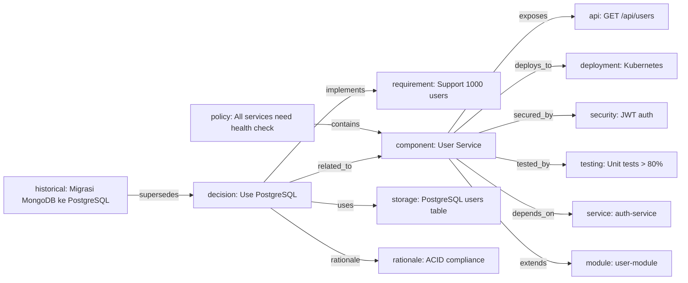
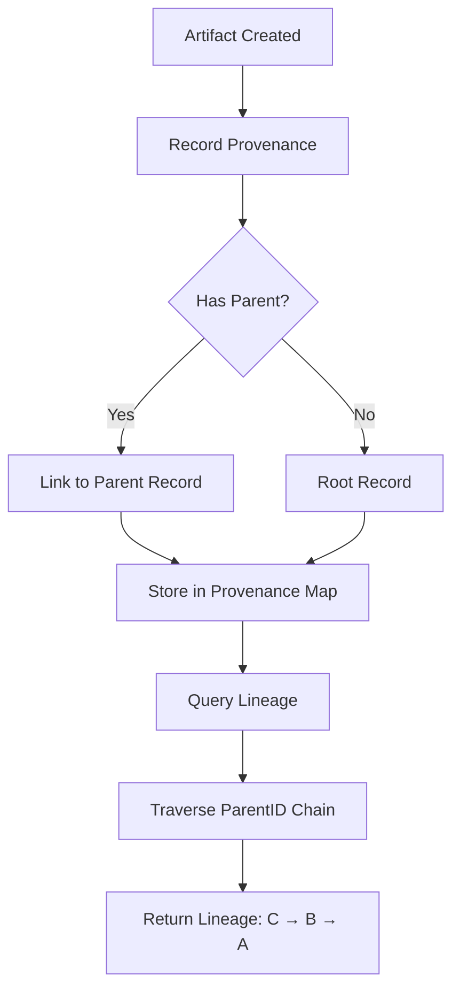

# NES-037 Knowledge Graph & Provenance

## 1. Status
- Status: Draft
- Version: 0.1
- Owner: NAEOS Core Team

## 2. Purpose
Dokumentasi referensi untuk package `internal/knowledge` — knowledge graph untuk representasi relasional pengetahuan engineering dan provenance store untuk pelacakan lineage artefak.

## 3. Scope
Dokumen ini mencakup model graph, tipe node/edge, operasi query, provenance tracking, dan lineage traversal.

## 4. Normative References
- NES-010 Knowledge — model knowledge dan provenance
- NES-023 NEIR — model engineering sentral
- NAEOS-GOV-005 Core Principles — Every Artifact Must Be Traceable

## 5. Knowledge Graph

### 5.1 Architecture



```
KnowledgeGraph
├── nodes: map[string]*Node
└── edges: []Edge
```

Thread-safe melalui `sync.RWMutex`.

### 5.2 Node Types

Tipe | Deskripsi | Contoh Use Case
-----|-----------|-----------------
decision | Keputusan engineering | "Menggunakan PostgreSQL"
requirement | Kebutuhan fungsional | "Sistem harus mendukung 1000 user"
rationale | Alasan di balik keputusan | "PostgreSQL dipilih untuk ACID compliance"
component | Komponen sistem | "User Service"
policy | Aturan governance | "Semua service harus punya health check"
implementation | Detail implementasi | "Menggunakan GORM untuk ORM"
historical | Riwayat perubahan | "Migrasi dari MongoDB ke PostgreSQL"
service | Service dalam proyek | "auth-service"
module | Modul dalam proyek | "user-module"
api | Endpoint API | "GET /api/users"
storage | Penyimpanan data | "PostgreSQL users table"
deployment | Konfigurasi deployment | "Kubernetes deployment"
testing | Strategi pengujian | "Unit test coverage > 80%"
security | Kontrol keamanan | "JWT authentication"

### 5.3 Edge Types

Tipe | Deskripsi
-----|----------
depends_on | Dependensi antar node
implements | Implementasi dari interface/spesifikasi
related_to | Relasi umum
supersedes | Menggantikan node sebelumnya
conflicts_with | Konflik dengan node lain
contains | Mengandung child node
exposes | Mengekspos API/endpoint
connects_to | Koneksi ke service lain
deploys_to | Deploy ke target
tests | Pengujian dari komponen
secures | Keamanan dari komponen
uses | Menggunakan komponen
extends | Meng-extend komponen lain

### 5.4 Types

#### Node

```go
type Node struct {
    ID        string
    Type      NodeType
    Topic     string
    Component string
    Version   string
    Content   string
    Metadata  map[string]string
}
```

#### Edge

```go
type Edge struct {
    From   string
    To     string
    Type   EdgeType
    Weight int
}
```

### 5.5 Constructor

```go
func New() *KnowledgeGraph
```

### 5.6 CRUD Operations

Metode | Deskripsi | Error Jika
-------|-----------|------------
AddNode(n) | Menambah node baru | ID kosong atau sudah ada
GetNode(id) | Mengambil node by ID | -
RemoveNode(id) | Menghapus node dan semua edge terkait | Node tidak ditemukan
AddEdge(e) | Menambah edge baru | Source/target node tidak ditemukan

### 5.7 Query Operations

#### By Topic

```go
func (kg *KnowledgeGraph) FindByTopic(topic string) []*Node
```

#### By Component

```go
func (kg *KnowledgeGraph) FindByComponent(component string) []*Node
```

#### By Version

```go
func (kg *KnowledgeGraph) FindByVersion(version string) []*Node
```

#### By Type

```go
func (kg *KnowledgeGraph) FindByType(nodeType NodeType) []*Node
```

#### By Edge Type

```go
func (kg *KnowledgeGraph) FindByEdgeType(edgeType EdgeType) []Edge
```

#### By Metadata

```go
func (kg *KnowledgeGraph) FindByMetadata(key, value string) []*Node
```

#### Graph Traversal

Metode | Deskripsi
-------|----------
FindEdgesFrom(id) | Edge keluar dari node
FindEdgesTo(id) | Edge masuk ke node
GetNeighbors(id) | Node tetangga (outgoing)
GetPredecessors(id) | Node pendahulu (incoming)
GetConnected(id) | Semua node yang terhubung (bidirectional)
HasPath(from, to) | Cek jalur antara dua node (BFS)

#### Statistics

Metode | Deskripsi
-------|----------
NodeCount() | Jumlah node
EdgeCount() | Jumlah edge
Nodes() | Semua node
Edges() | Semua edge

## 6. Provenance Store



### 6.1 Architecture

```
ProvenanceStore
└── records: map[string]*ProvenanceRecord
```

Thread-safe melalui `sync.RWMutex`.

### 6.2 Types

#### ProvenanceRecord

```go
type ProvenanceRecord struct {
    ID            string
    Source        string
    Version       string
    ArtifactID    string
    NEIRReference string
    CreatedBy     string
    Timestamp     time.Time
    PolicyContext string
    ParentID      string
    Metadata      map[string]string
}
```

Field | Tipe | Deskripsi
------|------|----------
ID | string | ID unik record
Source | string | Sumber artefak
Version | string | Versi artefak
ArtifactID | string | ID artefak yang terkait
NEIRReference | string | Referensi ke NEIR
CreatedBy | string | Pembuat record
Timestamp | time.Time | Waktu pembuatan (otomatis jika zero)
PolicyContext | string | Konteks policy yang berlaku
ParentID | string | ID record parent (untuk lineage)
Metadata | map[string]string | Metadata tambahan

### 6.3 Constructor

```go
func NewStore() *ProvenanceStore
```

### 6.4 Operations

Metode | Deskripsi | Error Jika
-------|-----------|------------
Record(record) | Menyimpan provenance record baru | ID kosong atau sudah ada; Timestamp diisi otomatis jika zero
Get(id) | Mengambil record by ID | -
FindByArtifact(artifactID) | Mencari record berdasarkan artifact ID | -
FindBySource(source) | Mencari record berdasarkan sumber | -
FindByCreator(createdBy) | Mencari record berdasarkan pembuat | -
Lineage(id) | Menelusuri lineage mundur dari record | Record tidak ditemukan
Count() | Jumlah record | -
Records() | Semua record | -

### 6.5 Lineage Traversal

```go
func (ps *ProvenanceStore) Lineage(id string) ([]*ProvenanceRecord, error)
```

Menelusuri lineage mundur (backward) dari record yang diberikan mengikuti ParentID.

```
Record C (id: "c", parent: "b")
  └── Record B (id: "b", parent: "a")
        └── Record A (id: "a", parent: "")
```

Lineage("c") -> [C, B, A]

## 7. Usage Example

### Knowledge Graph

```go
kg := graph.New()

// Tambah node
kg.AddNode(graph.Node{
    ID:        "decision-001",
    Type:      graph.NodeTypeDecision,
    Topic:     "database",
    Component: "user-service",
    Content:   "Menggunakan PostgreSQL",
})

kg.AddNode(graph.Node{
    ID:        "component-001",
    Type:      graph.NodeTypeComponent,
    Topic:     "service",
    Component: "user-service",
    Content:   "User Service",
})

// Tambah edge
kg.AddEdge(graph.Edge{
    From: "decision-001",
    To:   "component-001",
    Type: graph.EdgeTypeRelatedTo,
})

// Query
decisions := kg.FindByType(graph.NodeTypeDecision)
related := kg.GetConnected("decision-001")
```

### Provenance

```go
store := provenance.NewStore()

// Record provenance
store.Record(provenance.ProvenanceRecord{
    ID:         "record-001",
    Source:     "spec-minimal.yaml",
    ArtifactID: "main.go",
    CreatedBy:  "pipeline",
})

// Lineage
lineage, err := store.Lineage("record-001")
```

## 8. Constraints

- Knowledge Graph: node ID harus unik, edge hanya bisa dibuat antara node yang ada.
- Provenance: record ID harus unik, ParentID harus merujuk ke record yang ada (tidak divalidasi saat insert, divalidasi saat lineage traversal).
- Keduanya menggunakan in-memory storage (tidak persisten antar sesi).
