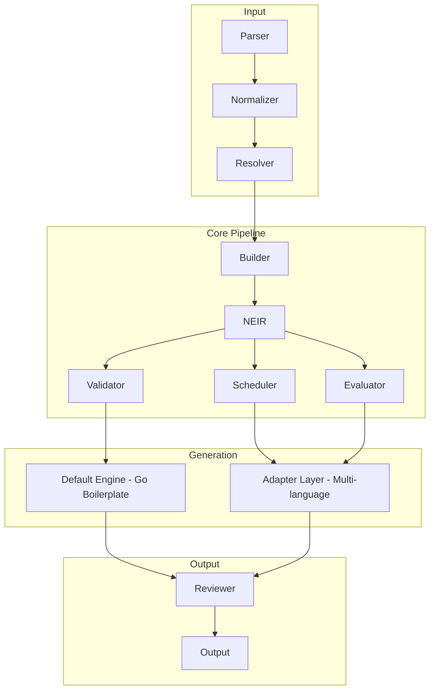

Document ID: NAEOS-SPEC-001
Title: NAEOS Overview
Version: 1.0.0
Status: Stable
Category: Core Specification
Owner: NAEOS Foundation
Priority: Critical

Normative: Yes

Depends On:
  - NAEOS-GOV-001
  - NAEOS-GOV-005
  - NAEOS-GOV-008

Referenced By:
  - All Specification Documents
NAEOS Core Specification Overview
Executive Summary

Dokumen ini merupakan spesifikasi inti NAEOS yang mendefinisikan ruang lingkup, model konseptual, terminologi, komponen utama, dan hubungan antarbagian dalam ekosistem NAEOS.

Seluruh implementasi NAEOS MUST mengacu pada spesifikasi ini sebagai dasar.

1. Purpose

Tujuan dokumen ini adalah:

mendefinisikan apa itu NAEOS,
menjelaskan ruang lingkup spesifikasi,
menetapkan istilah resmi,
menjadi referensi utama bagi seluruh dokumen lain.
2. Definition
NAEOS

NAEOS (Nusantara AI Engineering Operating Specification) adalah spesifikasi terbuka untuk pengembangan perangkat lunak berbasis AI yang mengintegrasikan engineering knowledge, standar, tata kelola, dan otomasi dalam satu model yang konsisten.

NAEOS bukan:

Framework
IDE
Programming Language
LLM
Cloud Platform

NAEOS adalah Engineering Specification Platform.

3. Design Goals

NAEOS dirancang dengan tujuan:

G1 — Human Readable

Dokumen mudah dipahami oleh engineer.

G2 — Machine Readable

Dokumen dapat diproses oleh compiler dan validator.

G3 — Vendor Neutral

Tidak bergantung pada penyedia AI tertentu.

G4 — Extensible

Dapat diperluas melalui profile, extension, dan plugin.

G5 — Deterministic

Input yang sama menghasilkan output yang konsisten.

4. Core Architecture



```
┌─────────────────────────────────────────────────────────┐
│                  NAEOS Architecture                     │
│                                                         │
│  ┌──────────┐  ┌──────────┐  ┌──────────┐  ┌────────┐ │
│  │  Parser   │→│Normalizer │→│ Resolver  │→│ Builder│ │
│  └──────────┘  └──────────┘  └──────────┘  └────────┘ │
│                                                     │   │
│                                               ┌─────▼─┐│
│                                               │  NEIR  ││
│                                               └───────┘│
│                                                     │   │
│              ┌──────────────────┐  ┌───────────────┤   │
│              │                  │  │               │   │
│        ┌─────▼──────┐   ┌──────▼──▼──┐   ┌───────▼──┐│
│        │  Validator  │   │Scheduler   │   │Evaluator ││
│        └────────────┘   └────────────┘   └──────────┘│
│              │                  │               │      │
│              ▼                  ▼               ▼      │
│  ┌──────────────────┐  ┌──────────────────────────┐   │
│  │ Default Engine   │  │   Adapter Layer          │   │
│  │ (Go boilerplate) │  │  (Go, TS, Python, Java,  │   │
│  │                  │  │   Rust — extensible)     │   │
│  └────────┬─────────┘  └────────────┬─────────────┘   │
│           └────────────┬────────────┘                  │
│                        ▼                               │
│                 ┌─────────────┐                        │
│                 │  Reviewer   │                        │
│                 └──────┬──────┘                        │
│                        ▼                               │
│                 ┌─────────────┐                        │
│                 │   Output    │                        │
│                 └─────────────┘                        │
└─────────────────────────────────────────────────────────┘
```
5. Core Components

Ekosistem NAEOS terdiri dari komponen berikut.

Governance

Mengatur organisasi, proses, dan kebijakan.

Specification

Menjadi sumber kebenaran engineering.

Constitution

Mendefinisikan aturan normatif.

Standards

Mendefinisikan standar implementasi.

Playbooks

Panduan implementasi.

Templates

Template siap pakai.

Compiler

Mengubah specification menjadi artefak.

Validator

Memastikan specification valid.

CLI

Antarmuka pengguna.

SDK

Multi-language library untuk integrasi dengan ekosistem NAEOS. SDK mendukung generasi kode dalam 5 bahasa pemrograman utama:
- Go
- TypeScript
- Python
- Java
- Rust

Arsitektur SDK menggunakan sistem Adapter yang memungkinkan penambahan bahasa baru tanpa mengubah kompiler inti. Setiap bahasa diimplementasikan sebagai OutputAdapter yang terdaftar secara otomatis melalui `init()`.

Compiler menghasilkan artefak dalam dua lapisan:
- **Default Engine** — menghasilkan boilerplate Go-centric (README, Dockerfile, CI, go.mod, module scaffolding)
- **Adapter Layer** — dispatch ke OutputAdapter per bahasa untuk menghasilkan project files, Dockerfiles, CI workflows, dan module structures

Lihat NAEOS-SPEC-008 (Compiler Model) untuk detail arsitektur adapter.

Reference Platform

Implementasi referensi NAEOS.

6. Engineering Workflow
7. Specification Hierarchy
Governance

↓

Core Specification

↓

Constitution

↓

Standards

↓

Profiles

↓

Playbooks

↓

Templates

↓

Implementation

Dokumen di tingkat bawah tidak boleh bertentangan dengan dokumen di atasnya.

8. Engineering Knowledge Model

NAEOS memandang knowledge sebagai aset utama.

Model konseptual:

Intent

↓

Requirement

↓

Knowledge

↓

Specification

↓

Automation

↓

Software
9. Normative Language

Istilah berikut digunakan sesuai praktik RFC:

Keyword	Makna
MUST	Wajib
MUST NOT	Dilarang
SHOULD	Sangat dianjurkan
SHOULD NOT	Sebaiknya tidak
MAY	Opsional

Seluruh implementasi NAEOS harus memahami istilah ini secara konsisten.

10. Artifact Model

Setiap artefak NAEOS memiliki:

Identifier unik
Metadata
Owner
Version
Status
Dependency
Traceability
Revision History

Artefak dikategorikan dalam tiga kategori utama:
- **Specification Artifacts** — dokumen YAML/JSON yang mendefinisikan sistem
- **Generated Artifacts** — output dari compiler (source code, Dockerfile, CI, dokumentasi)
- **Governance Artifacts** — dokumen tata kelola, proses, dan standar

Setiap artefak yang dihasilkan oleh compiler harus terintegrasi dalam NEIR (Nusantara Enterprise Intermediate Representation) sebagai representasi antara sebelum ditransformasi ke target output.
11. Interoperability

NAEOS harus dapat digunakan oleh:

GitHub Copilot
Claude Code
Cursor
Gemini CLI
OpenAI Codex
Continue
Cline
OpenCode
AI Agent internal organisasi

Tanpa mengubah spesifikasi inti.

### 11.1 Multi-Language SDK Interoperability

SDK NAEOS mendukung integrasi dengan toolchain berbagai bahasa pemrograman. Setiap bahasa memiliki adapter yang menghasilkan artefak sesuai konvensi bahasa tersebut:

| Bahasa | Build Tool | Package Registry | Container Base |
|--------|-----------|-----------------|----------------|
| Go | go mod | Go Module Proxy | `golang:1.22-alpine` |
| TypeScript | npm/yarn | npm | `node:22-alpine` |
| Python | pip/poetry | PyPI | `python:3.12-slim` |
| Java | Maven/Gradle | Maven Central | `eclipse-temurin:21-jdk-alpine` |
| Rust | Cargo | crates.io | `rust:1.78-alpine` |

Pipeline mendukung penghasilan artefak untuk satu atau banyak bahasa secara bersamaan dari satu spesifikasi.

12. Security Principles

Semua implementasi:

MUST:

memvalidasi input,
menjaga integritas spesifikasi,
melacak perubahan.

SHOULD:

mendukung audit,
menyediakan log perubahan.
13. Conformance

Sebuah implementasi dapat disebut NAEOS Compatible apabila:

mengikuti spesifikasi inti,
lulus validasi resmi,
menggunakan metadata standar,
tidak melanggar Core Principles.
14. Future Extensions

NAEOS dirancang agar mendukung:

Domain Profiles
AI Profiles
Industry Standards
Compiler Plugins
Runtime Extensions
Marketplace
Knowledge Registry
Custom Output Adapters (bahasa pemrograman baru)
SDK Plugin System (extended functionality per bahasa)

Tanpa mengubah spesifikasi inti.

Sistem adapter memungkinkan komunitas untuk menambahkan dukungan bahasa pemrograman baru dengan cara:
1. Mengimplementasikan `OutputAdapter` interface
2. Mendaftarkan adapter melalui `init()`
3. Adapter akan secara otomatis tersedia untuk dispatch oleh pipeline

15. Related Documents
ID	Document
NAEOS-GOV-001	Project Charter
NAEOS-GOV-005	Core Principles
NAEOS-SPEC-002	Engineering Knowledge Model
NAEOS-SPEC-003	Document Model
NAEOS-SPEC-008	Compiler Model
NES-039	SDK Multi-Language Specification
NES-040	Output Adapter Architecture

Revision History
Version	Date	Change
1.0.0	2026-07-09	Initial Core Specification Overview
1.1.0	2026-07-10	Added multi-language SDK architecture, fixed Core Architecture diagram, expanded Artifact Model, added SDK Interoperability
Status
NAEOS-SPEC-001

APPROVED

Normative Specification

Ready For Implementation
