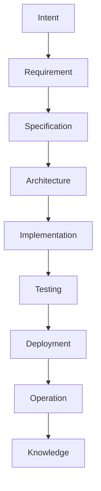
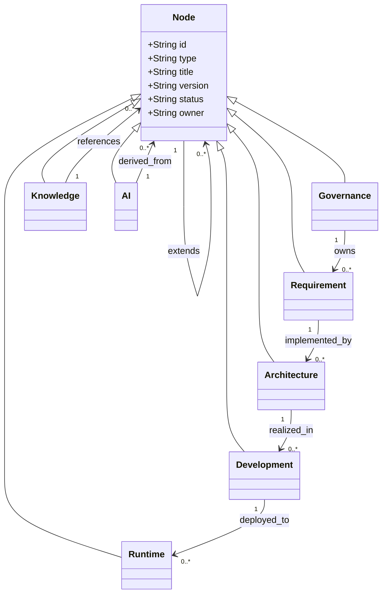

Document ID: NAEOS-SPEC-002

Title: Engineering Knowledge Graph

Short Name: EKG

Version: 1.0.0

Status: Stable

Category: Core Specification

Normative: true

Owner: NAEOS Foundation

Priority: Critical

Depends On:

- NAEOS-SPEC-001

Referenced By:

- Compiler

- Validator

- CLI

- AI Runtime

- Knowledge Registry
Engineering Knowledge Graph (EKG)
Executive Summary

Engineering Knowledge Graph (EKG) adalah model data inti NAEOS.

EKG merepresentasikan seluruh knowledge engineering sebagai graph sehingga dapat dipahami oleh:

Human
AI Agent
Compiler
Validator
Search Engine
IDE
Documentation Generator

Seluruh artefak NAEOS MUST direpresentasikan sebagai node dan relationship di dalam Engineering Knowledge Graph.

1. Purpose

EKG dibuat untuk mengatasi masalah klasik engineering:

knowledge tersebar
dokumentasi terpisah
AI kehilangan konteks
dependency sulit diketahui
impact analysis manual

EKG menyatukan seluruh knowledge ke dalam satu graph.

2. Design Goals

Engineering Knowledge Graph harus:

✅ Human Readable

✅ Machine Readable

✅ Queryable

✅ Extensible

✅ Versioned

✅ Traceable

✅ AI Friendly

3. High Level Model

Intent

↓

Requirement

↓

Specification

↓

Architecture

↓

Implementation

↓

Testing

↓

Deployment

↓

Operation

↓

Knowledge

Semua objek saling terhubung.

4. Core Node Types

EKG mendefinisikan node berikut.

Governance

Contoh:

Project Charter

Vision

Mission

Manifesto

Roadmap
Requirement

Contoh:

Business Requirement

Functional Requirement

Non Functional Requirement
Architecture

Contoh:

System

Service

Module

Package

Component
Knowledge

Contoh:

Playbook

Pattern

Guideline

Best Practice

Checklist
Development

Contoh:

Repository

Branch

Commit

Release
AI

Contoh:

Prompt

Agent

Tool

Workflow

Memory
Runtime

Contoh:

Service

Database

API

Queue

Cache
5. Relationship Types

EKG memiliki relationship resmi.

depends_on
Compiler

↓

depends_on

↓

Specification
implements
Component

↓

implements

↓

Requirement
references
Playbook

↓

references

↓

Standard
validates
Validator

↓

validates

↓

Specification
generates
Compiler

↓

generates

↓

Markdown
owns
Organization

↓

owns

↓

Repository
extends
Healthcare Profile

↓

extends

↓

Core Profile
derived_from
Prompt

↓

derived_from

↓

Specification
6. Graph Rules

Semua node

MUST memiliki

ID

Type

Title

Version

Status

Owner

Semua relationship

MUST memiliki

Type

Source

Target
7. Node Metadata

Contoh

id:

type:

title:

version:

owner:

status:

created_at:

updated_at:
8. Graph Layers
Governance

↓

Knowledge

↓

Specification

↓

Architecture

↓

Implementation

↓

Operation
9. Knowledge Flow
Diagram tidak valid atau tidak didukung.
10. Query Examples

Compiler

Find all Standards
referenced by API Module

AI

Find every Rule
related to Authentication

Validator

Find orphan nodes

Review

Find affected documents
11. AI Context Model

Saat AI bekerja,

context dibangun dari graph.

Misal:

Task

↓

Component

↓

Requirement

↓

Architecture

↓

Standards

↓

Playbooks

↓

Patterns

AI tidak lagi membaca folder.

AI membaca graph.

12. Compiler Integration

Compiler menghasilkan

Markdown

Website

PDF

JSON

LLM Context

Copilot Prompt

Claude Context

Gemini Context

Semua berasal dari graph yang sama.

13. Future Graph Database

EKG dapat diimplementasikan menggunakan:

Neo4j
Memgraph
PostgreSQL + Apache AGE
ArangoDB
Amazon Neptune
Azure Cosmos DB (Gremlin)

Spesifikasi inti tidak bergantung pada implementasi tertentu.

14. Conformance

Implementasi EKG:

MUST:

memiliki node unik,
memiliki relationship eksplisit,
dapat ditelusuri dua arah (bidirectional),
mendukung versioning.

SHOULD:

menyediakan query API,
mendukung visualisasi graph,
mendukung ekspor/impor.
15. Related Documents
SPEC-001 Overview

SPEC-003 Document Model

SPEC-004 Metadata

SPEC-005 Rule Model

SPEC-006 Dependency Graph
Status
APPROVED

Engineering Knowledge Graph
Established
