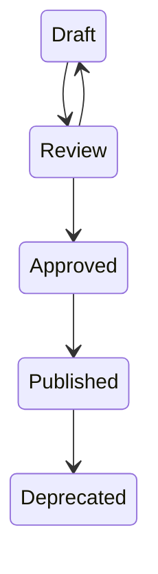
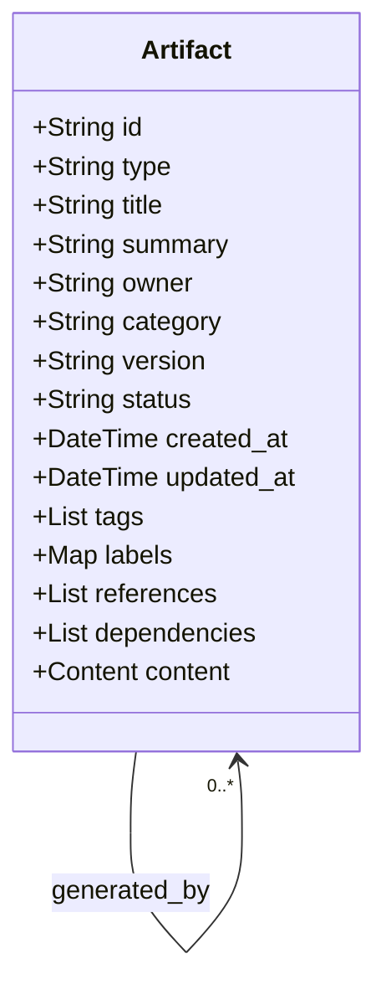

Document ID: NAEOS-SPEC-003

Title: Universal Artifact Model

Short Name: UAM

Version: 1.0.0

Status: Stable

Category: Core Specification

Normative: true

Priority: Critical

Owner: NAEOS Foundation

Depends On:

- SPEC-001

- SPEC-002
Universal Artifact Model (UAM)
Executive Summary

Universal Artifact Model (UAM) adalah model data universal yang digunakan oleh seluruh artefak dalam ekosistem NAEOS.

Setiap artefak direpresentasikan sebagai Artifact Object yang memiliki struktur metadata, konten, relasi, versi, dan jejak perubahan yang konsisten.

Dengan UAM, compiler hanya perlu memahami satu model data untuk memproses seluruh jenis artefak.

1. Purpose

UAM bertujuan untuk:

Menyatukan representasi seluruh artefak.
Menyederhanakan compiler dan validator.
Memastikan interoperabilitas.
Mendukung traceability dan versioning.
Mempermudah integrasi dengan AI.
2. Artifact Definition

Sebuah Artifact adalah setiap objek engineering yang memiliki identitas, metadata, konten, dan hubungan dengan artefak lain.

Contoh Artifact:

Document
Standard
Constitution
Rule
RFC
ADR
Template
Prompt
Workflow
Source Code
Test Case
API Contract
Deployment Manifest
3. Artifact Lifecycle



4. Universal Structure
artifact:

  id:

  type:

  title:

  summary:

  owner:

  category:

  version:

  status:

  created_at:

  updated_at:

  tags:

  labels:

  references:

  dependencies:

  content:
5. Mandatory Fields

Semua Artifact MUST memiliki:

Field	Requirement
id	MUST
type	MUST
title	MUST
version	MUST
status	MUST
owner	MUST
content	MUST
6. Artifact Types

Jenis artefak standar:

Document
Specification
Constitution
Standard
Policy
Rule
RFC
ADR
Template
Playbook
Guide
Checklist
Schema
Prompt
Workflow
API
Component
Module
Package
Repository
Test
Deployment
Knowledge

Implementasi dapat menambahkan tipe baru tanpa mengubah spesifikasi inti.



7. Identity Model

Setiap Artifact memiliki Artifact ID yang unik.

Format:

<DOMAIN>-<CATEGORY>-<NUMBER>

Contoh:

NAEOS-GOV-001
NAEOS-SPEC-003
NAEOS-STD-012
NAEOS-RFC-0042
NAEOS-ADR-0015

Artifact ID MUST NOT berubah selama siklus hidup artefak.

8. Metadata Model

Metadata dibagi menjadi:

Identity Metadata
Ownership Metadata
Version Metadata
Classification Metadata
Relationship Metadata
Security Metadata

Metadata harus dapat diproses mesin tanpa membaca isi dokumen.

9. Relationship Model

Setiap Artifact dapat memiliki relasi:

depends_on

references

extends

implements

supersedes

duplicates

derived_from

generated_by

owned_by

Relasi harus konsisten dengan Engineering Knowledge Graph.

### 9.1 generated_by Relationship

Relasi `generated_by` digunakan untuk artefak yang dihasilkan oleh compiler:

```
Source Artifact (specification YAML)
       │
       │  generated_by → adapter
       │
       ▼
Generated Artifact (Go / TypeScript / Python / Java / Rust source code)
```

Setiap artefak output memiliki metadata:
- `generated_by` — adapter identifier (contoh: `"go"`, `"typescript"`)
- `generated_at` — timestamp generasi
- `language` — bahasa target
- `source_spec` — path ke spesifikasi sumber

Relasi ini memungkinkan traceability dari artefak output kembali ke spesifikasi aslinya.

10. Traceability

Setiap Artifact harus dapat ditelusuri.

Contoh:

Business Requirement

↓

Specification

↓

Architecture

↓

Component

↓

Source Code

↓

Test

↓

Deployment

Compiler harus mampu membangun rantai jejak ini secara otomatis.

11. Version Model

Artifact mengikuti Semantic Versioning.

Perubahan metadata tidak selalu mengubah versi.

Perubahan normatif MUST menaikkan versi sesuai kebijakan Versioning Policy.

12. Validation Rules

Validator harus memeriksa:

ID unik.
Metadata lengkap.
Status valid.
Relasi valid.
Referensi tidak rusak.
Dependensi tidak melingkar (kecuali diizinkan).
13. Serialization

Artifact harus dapat diekspor ke:

Markdown
YAML
JSON
XML (opsional)
PDF (render)
HTML
Graph Node

Tanpa kehilangan informasi penting.

14. Compiler Behavior

Compiler memperlakukan semua Artifact dengan alur yang sama:

Artifact

↓

Parser

↓

Validator

↓

Knowledge Graph

↓

Transformation Engine

↓

Output Adapter

Perbedaan hanya terletak pada adapter output.

### 14.1 Multi-Adapter Output Model

Compiler menggunakan dua lapisan generasi:

```
         ┌─────────────────────────────────┐
         │       Transformation Engine      │
         └───────────────┬─────────────────┘
                         │
         ┌───────────────▼─────────────────┐
         │    Default Engine                │
         │    (Go-centric boilerplate)      │
         └───────────────┬─────────────────┘
                         │
         ┌───────────────▼─────────────────┐
         │    Adapter Layer                 │
         │    (per-language dispatch)       │
         └───────────────┬─────────────────┘
                         │
       ┌─────────────────┼─────────────────┐
       │                 │                 │
 ┌─────▼──────┐  ┌──────▼───────┐  ┌──────▼──────┐
 │ GoAdapter  │  │TSAdapter     │  │PyAdapter    │
 │ JavaAdapter│  │RustAdapter   │  │(extensible) │
 └────────────┘  └──────────────┘  └─────────────┘
```

### 14.2 NEIR as Intermediate Representation

Semua artefak ditransformasi ke NEIR (Nusantara Enterprise Intermediate Representation) sebelum dikirim ke output adapter:

```
Specification YAML
       │
       ▼
   Parser
       │
       ▼
   NormalizedSpec
       │
       ▼
   ResolvedSpec
       │
       ▼
   NEIR (Intermediate Representation)
       │
       ├──→ DefaultEngine → Go artifacts
       │
       └──→ Adapters → Language-specific artifacts
```

NEIR menjadi satu-satunya format input untuk adapter. Adapter tidak perlu memahami spesifikasi asli — hanya NEIR.

### 14.3 Generated Artifact Identity

Artefak yang dihasilkan oleh adapter memiliki identity:

```
generated_by: <adapter-language>
generated_at: <timestamp>
source_neir: <neir-hash>
language: <target-language>
```

Field `generated_by` pada metadata artefak output menunjukkan adapter mana yang menghasilkannya. Field `language` menunjukkan bahasa target.

15. Extension Model

Vendor atau organisasi dapat membuat Artifact baru.

Contoh:

Healthcare Guideline

extends

Standard

Ekstensi tidak boleh mengubah perilaku Artifact inti.

16. Conformance

Implementasi UAM MUST:

menggunakan struktur Artifact resmi,
mendukung metadata wajib,
mendukung traceability,
mendukung relationship,
kompatibel dengan Engineering Knowledge Graph.
17. Related Documents
ID	Document
NAEOS-SPEC-001	Overview
NAEOS-SPEC-002	Engineering Knowledge Graph
NAEOS-SPEC-004	Metadata Specification
NAEOS-SPEC-005	Rule Model
NAEOS-SPEC-008	Compiler Model
NAEOS-GOV-008	Versioning Policy
NES-039	SDK Multi-Language Specification
NES-040	Output Adapter Architecture
Revision History
Version	Date	Change
1.0.0	2026-07-09	Initial Universal Artifact Model
1.1.0	2026-07-10	Expanded Compiler Behavior with multi-adapter model, NEIR, and generated_by relationship
Status
NAEOS-SPEC-003

APPROVED

Universal Artifact Model Established
