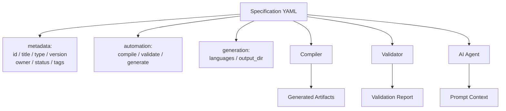

Document ID: NAEOS-SPEC-004

Title: Metadata Specification

Short Name: Metadata Spec

Version: 1.0.0

Status: Stable

Category: Core Specification

Normative: true

Priority: Critical

Owner: NAEOS Foundation

Depends On:

- SPEC-001
- SPEC-002
- SPEC-003
Metadata Specification
Executive Summary

Metadata Specification mendefinisikan struktur metadata resmi yang wajib digunakan oleh seluruh Artifact NAEOS.

Metadata berfungsi sebagai Machine Readable Contract yang memungkinkan compiler, validator, AI Agent, SDK, dan tooling memahami sebuah Artifact tanpa harus membaca seluruh kontennya.

1. Purpose

Metadata digunakan untuk:

identifikasi,
validasi,
klasifikasi,
versioning,
ownership,
dependency management,
traceability,
automation.
2. Metadata Architecture

```
┌─────────────────────────────────────────────────┐
│              Metadata Architecture              │
│                                                 │
│  ┌──────────────────────────────────────────┐  │
│  │         Specification YAML                │  │
│  │  ┌─────────────────────────────────────┐ │  │
│  │  │  metadata:                          │ │  │
│  │  │    id / title / type / version      │ │  │
│  │  │    owner / status / tags            │ │  │
│  │  │    automation:                      │ │  │
│  │  │      compile / validate / generate  │ │  │
│  │  │    generation:                      │ │  │
│  │  │      languages / output_dir         │ │  │
│  │  └─────────────────────────────────────┘ │  │
│  └──────────────────────────────────────────┘  │
│                       │                         │
│          ┌────────────┼────────────┐            │
│          ▼            ▼            ▼            │
│    ┌──────────┐ ┌──────────┐ ┌──────────┐     │
│    │ Compiler │ │ Validator│ │ AI Agent │     │
│    └──────────┘ └──────────┘ └──────────┘     │
└─────────────────────────────────────────────────┘
```

Metadata menjadi pintu masuk seluruh proses.



3. Metadata Categories

Metadata dibagi menjadi delapan kategori utama.

Category	Purpose
Identity	Identitas artefak
Classification	Klasifikasi
Ownership	Kepemilikan
Versioning	Versi
Lifecycle	Status siklus hidup
Relationship	Relasi
Security	Keamanan
Automation	Instruksi untuk tooling
4. Canonical Metadata Schema

Seluruh Artifact harus mengikuti struktur berikut.

metadata:

  id:

  title:

  type:

  category:

  summary:

  owner:

  maintainers:

  version:

  status:

  visibility:

  tags:

  labels:

  created_at:

  updated_at:

  review_cycle:

  dependencies:

  references:

  supersedes:

  security_level:

  compliance:

  automation:

  checksum:
5. Identity Metadata

Wajib ada.

id:

title:

type:

ID harus unik.

Judul harus deskriptif.

Type harus berasal dari daftar tipe resmi.

6. Ownership Metadata
owner:

maintainers:

reviewers:

organization:

Compiler dapat menentukan siapa yang bertanggung jawab terhadap Artifact.

7. Version Metadata
version:

status:

last_review:

next_review:

Digunakan oleh:

validator,
release manager,
compiler.
8. Relationship Metadata

Contoh:

depends_on:

references:

implements:

derived_from:

related_to:

Relationship ini secara otomatis menjadi edge pada Engineering Knowledge Graph.

9. Security Metadata

Contoh:

security_level:

confidentiality:

integrity:

availability:

Level:

Public
Internal
Confidential
Restricted
10. Automation Metadata

Compiler membaca bagian ini.

automation:

  compile:

  validate:

  generate:

  publish:

  ai_context:

generation:

  languages:

  output_dir:

  module_dir:

Contoh:

automation:

  compile: true

  validate: true

  publish: website

  ai_context: required

generation:

  languages:

    - go

    - typescript

  output_dir: ./generated

  module_dir: ./internal

### 10.1 Generation Configuration

Section `generation:` pada spec YAML mendefinisikan target bahasa dan direktori output untuk generasi artefak:

| Field | Type | Description |
|-------|------|-------------|
| `languages` | `[]string` | Daftar bahasa target (contoh: `go`, `typescript`, `python`, `java`, `rust`) |
| `output_dir` | `string` | Direktori output untuk artefak yang dihasilkan |
| `module_dir` | `string` | Direktori root untuk module structures |

### 10.2 Language Resolution

Pipeline menentukan bahasa target dengan urutan berikut:

1. CLI `--language` flag (override tertinggi)
2. `generation.languages` pada spec YAML
3. Default: `["go"]`

Jika bahasa tidak dikenal, pipeline akan melewatinya tanpa error (skip silently).

### 10.3 Supported Languages

| Language | Identifier | Build File | Default Base Image |
|----------|-----------|------------|-------------------|
| Go | `go` | `go.mod` | `golang:1.22-alpine` |
| TypeScript | `typescript` | `package.json` | `node:22-alpine` |
| Python | `python` | `pyproject.toml` | `python:3.12-slim` |
| Java | `java` | `pom.xml` | `eclipse-temurin:21-jdk-alpine` |
| Rust | `rust` | `Cargo.toml` | `rust:1.78-alpine` |

### 10.4 CLI Override

```
naeos run --config config.yaml --input spec.yaml --language go --language typescript
```

Flag `--language` dapat digunakan beberapa kali untuk menghasilkan artefak dalam beberapa bahasa secara bersamaan. Nilai CLI akan menimpa `generation.languages` dari spec YAML.
11. Metadata Inheritance

Artifact dapat mewarisi metadata.

Contoh:

Project

↓

Module

↓

Component

↓

Document

Jika owner tidak didefinisikan pada Component, maka owner diwarisi dari Module.

12. Metadata Validation

Validator harus memeriksa:

field wajib,
tipe data,
format,
referensi,
nilai enum,
checksum,
kompatibilitas versi.
13. JSON Schema Mapping

Seluruh Metadata Specification harus memiliki representasi resmi dalam JSON Schema.

Contoh:

{
  "type": "object",
  "required": [
    "id",
    "title",
    "version",
    "status",
    "owner"
  ]
}

JSON Schema menjadi sumber validasi bagi compiler dan CLI.

14. AI Context Generation

Metadata menjadi dasar penyusunan konteks AI.

Urutan pemrosesan:

Metadata

↓

Dependencies

↓

Related Standards

↓

Knowledge Graph

↓

Prompt Context

↓

AI

AI tidak perlu membaca seluruh repository.

AI cukup membaca metadata dan graph untuk membangun konteks yang relevan.

15. Metadata Compatibility

Semua implementasi NAEOS:

MUST

mendukung metadata resmi,
mempertahankan kompatibilitas,
memvalidasi metadata sebelum pemrosesan.

SHOULD

mendukung metadata extension.

MAY

menambahkan field khusus organisasi dengan namespace sendiri.
16. Extension Rules

Ekstensi metadata harus menggunakan namespace.

Contoh:

x-company:

  owner_team:

  jira_project:

  compliance_code:

Dengan pendekatan ini, metadata inti tetap stabil sementara organisasi dapat menambahkan informasi khusus tanpa mengganggu interoperabilitas.

17. Conformance

Sebuah Artifact dinyatakan Metadata Compliant apabila:

seluruh field wajib tersedia,
format sesuai schema,
relasi valid,
lolos validasi JSON Schema,
dapat diproses oleh compiler resmi.
18. Related Documents
ID	Document
NAEOS-SPEC-001	Overview
NAEOS-SPEC-002	Engineering Knowledge Graph
NAEOS-SPEC-003	Universal Artifact Model
NAEOS-SPEC-005	Rule Model
NAEOS-SPEC-008	Compiler Model
NAEOS-GOV-008	Versioning Policy
NES-039	SDK Multi-Language Specification
NES-040	Output Adapter Architecture
Revision History
Version	Date	Change
1.0.0	2026-07-09	Initial Metadata Specification
1.1.0	2026-07-10	Expanded Automation Metadata with generation config, multi-language support, and CLI override
Status
NAEOS-SPEC-004

APPROVED

Metadata Contract Established
