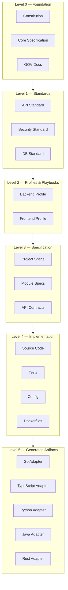

Document ID: NAEOS-SPEC-006

Title: Dependency Graph

Short Name: DG

Version: 1.0.0

Status: Stable

Category: Core Specification

Normative: true

Priority: Critical

Owner: NAEOS Foundation

Depends On:

- SPEC-001
- SPEC-002
- SPEC-003
- SPEC-004
- SPEC-005

Referenced By:

- Compiler

- Validator

- CLI

- Studio

- SDK

- AI Runtime
Dependency Graph Specification
Executive Summary

Dependency Graph (DG) adalah model resmi yang mendefinisikan hubungan dependensi antar Artifact dalam ekosistem NAEOS.

DG memungkinkan sistem memahami:

urutan kompilasi,
dampak perubahan,
hubungan lintas dokumen,
propagasi perubahan,
validasi dependensi,
visualisasi knowledge.

Dependency Graph merupakan implementasi operasional dari Engineering Knowledge Graph.

1. Purpose

Dependency Graph bertujuan untuk:

membangun hubungan eksplisit antar Artifact,
memungkinkan incremental compilation,
mendukung impact analysis,
menghindari circular dependency,
meningkatkan efisiensi compiler.
2. Dependency Model
Artifact A

↓

depends_on

↓

Artifact B

Artinya:

Artifact A memerlukan Artifact B agar dapat diproses dengan benar.

3. Graph Architecture



```
┌─────────────────────────────────────────────────────────┐
│                 Dependency Graph Architecture            │
│                                                         │
│  ┌──────────────────────────────────────────────────┐  │
│  │              Level 0 — Foundation                │  │
│  │   Constitution, Core Specification, GOV docs     │  │
│  └────────────────────────┬─────────────────────────┘  │
│                           │                             │
│  ┌────────────────────────▼─────────────────────────┐  │
│  │              Level 1 — Standards                 │  │
│  │   API Standard, Security Standard, DB Standard   │  │
│  └────────────────────────┬─────────────────────────┘  │
│                           │                             │
│  ┌────────────────────────▼─────────────────────────┐  │
│  │              Level 2 — Profiles & Playbooks      │  │
│  │   Backend Profile, Frontend Profile, etc.        │  │
│  └────────────────────────┬─────────────────────────┘  │
│                           │                             │
│  ┌────────────────────────▼─────────────────────────┐  │
│  │              Level 3 — Specification             │  │
│  │   Project specs, Module specs, API contracts     │  │
│  └────────────────────────┬─────────────────────────┘  │
│                           │                             │
│  ┌────────────────────────▼─────────────────────────┐  │
│  │              Level 4 — Implementation            │  │
│  │   Source Code, Tests, Config, Dockerfiles        │  │
│  └────────────────────────┬─────────────────────────┘  │
│                           │                             │
│  ┌────────────────────────▼─────────────────────────┐  │
│  │              Level 5 — Generated Artifacts       │  │
│  │   Go, TypeScript, Python, Java, Rust adapters    │  │
│  └──────────────────────────────────────────────────┘  │
└─────────────────────────────────────────────────────────┘
```

Semakin tinggi level, semakin banyak artefak yang bergantung padanya.

4. Dependency Types

NAEOS mendefinisikan beberapa jenis dependency resmi.

Hard Dependency

Artifact tidak dapat diproses tanpa dependency.

Contoh:

Specification membutuhkan Metadata Specification.

Soft Dependency

Dependency bersifat opsional.

Contoh:

Playbook mereferensikan Best Practice.

Runtime Dependency

Hanya diperlukan saat runtime.

Contoh:

Plugin Compiler.

Build Dependency

Hanya diperlukan saat proses compile.

Contoh:

JSON Schema.

Reference Dependency

Digunakan untuk dokumentasi dan navigasi.

Tidak memengaruhi proses compile.

5. Dependency Metadata

Setiap dependency memiliki metadata.

dependency:

  target:

  type:

  required:

  version:

  scope:

  description:
6. Graph Rules

Dependency Graph harus memenuhi aturan berikut.

Rule 1

Setiap node MUST memiliki ID unik.

Rule 2

Setiap edge MUST memiliki tipe.

Rule 3

Dependency wajib harus tersedia.

Rule 4

Circular dependency MUST NOT terjadi kecuali dinyatakan eksplisit sebagai hubungan yang diizinkan.

Rule 5

Seluruh dependency harus dapat ditelusuri.

7. Dependency Resolution

Urutan penyelesaian dependency:

Load Metadata

↓

Load Dependencies

↓

Validate Versions

↓

Resolve Graph

↓

Compile

Jika satu dependency gagal, compiler harus menghentikan proses sesuai tingkat severity yang ditentukan oleh Rule Model.

8. Incremental Compilation

Dependency Graph memungkinkan compiler hanya membangun ulang artefak yang terdampak.

Contoh:

Specification A

↓

API Standard

↓

Backend Profile

↓

Project

Jika API Standard berubah, compiler cukup memproses node yang bergantung padanya, tanpa membangun ulang seluruh repository.

9. Impact Analysis

AI dan Compiler dapat menghitung dampak perubahan.

Contoh laporan:

change:

  artifact: API-Standard

affected:

  - Backend Profile

  - Project Alpha

  - Project Beta

risk:

  High

Fitur ini memungkinkan review yang lebih cepat dan akurat.

10. Graph Validation

Validator harus memeriksa:

dependency yang hilang,
versi tidak kompatibel,
siklus (cycle),
referensi rusak,
node yatim (orphan node),
dependency yang tidak digunakan.
11. Graph Query

Dependency Graph harus mendukung query seperti:

Find all dependents of SPEC-004

Find all orphan artifacts

Find circular dependencies

Find impacted components

Find transitive dependencies
12. Visualization

Dependency Graph harus dapat divisualisasikan.

Contoh:

Project

├── Constitution

├── Standards

│     ├── API

│     ├── Security

│     └── Database

├── Playbooks

└── Templates

Visualisasi ini akan menjadi dasar NAEOS Studio.

13. AI Integration

AI Agent menggunakan Dependency Graph untuk:

memahami konteks,
menghitung dampak,
menyusun prompt yang relevan,
memberikan rekomendasi perubahan,
menghindari perubahan yang merusak artefak lain.
14. Compiler Integration

Compiler memanfaatkan Dependency Graph untuk:

menentukan urutan compile,
cache hasil kompilasi,
incremental build,
dependency resolution,
parallel compilation jika memungkinkan.

### 14.1 Adapter Dependency Resolution

Ketika pipeline menghasilkan artefak multi-bahasa, Dependency Graph digunakan untuk:

1. **Menentukan urutan dispatch adapter** — adapter yang tidak memiliki inter-dependensi dapat dijalankan secara paralel.
2. **Mendeteksi konflik output** — jika dua adapter menghasilkan artefak dengan path yang sama, Dependency Graph akan menandai konflik.
3. **Menghitung dampak perubahan NEIR** — ketika NEIR berubah, graph menentukan adapter mana yang harus dijalankan ulang.

```
NEIR
  │
  ├──→ GoAdapter (independent)
  ├──→ TypeScriptAdapter (independent)
  ├──→ PythonAdapter (independent)
  ├──→ JavaAdapter (independent)
  └──→ RustAdapter (independent)
```

Semua adapter bersifat independent — tidak ada dependency antar adapter. Mereka semua bergantung pada NEIR sebagai input.
15. Conformance

Implementasi Dependency Graph MUST:

mendukung node dan edge resmi,
mampu mendeteksi cycle,
mendukung impact analysis,
menyediakan API query,
kompatibel dengan Engineering Knowledge Graph.
16. Related Documents
ID	Document
NAEOS-SPEC-002	Engineering Knowledge Graph
NAEOS-SPEC-003	Universal Artifact Model
NAEOS-SPEC-004	Metadata Specification
NAEOS-SPEC-005	Rule Model
NAEOS-SPEC-007	Validation Model
NAEOS-SPEC-008	Compiler Model
NES-040	Output Adapter Architecture
Revision History
Version	Date	Change
1.0.0	2026-07-09	Initial Dependency Graph Specification
1.1.0	2026-07-10	Fixed Graph Architecture diagram, added adapter dependency resolution
Status
NAEOS-SPEC-006

APPROVED

Dependency Graph Established
