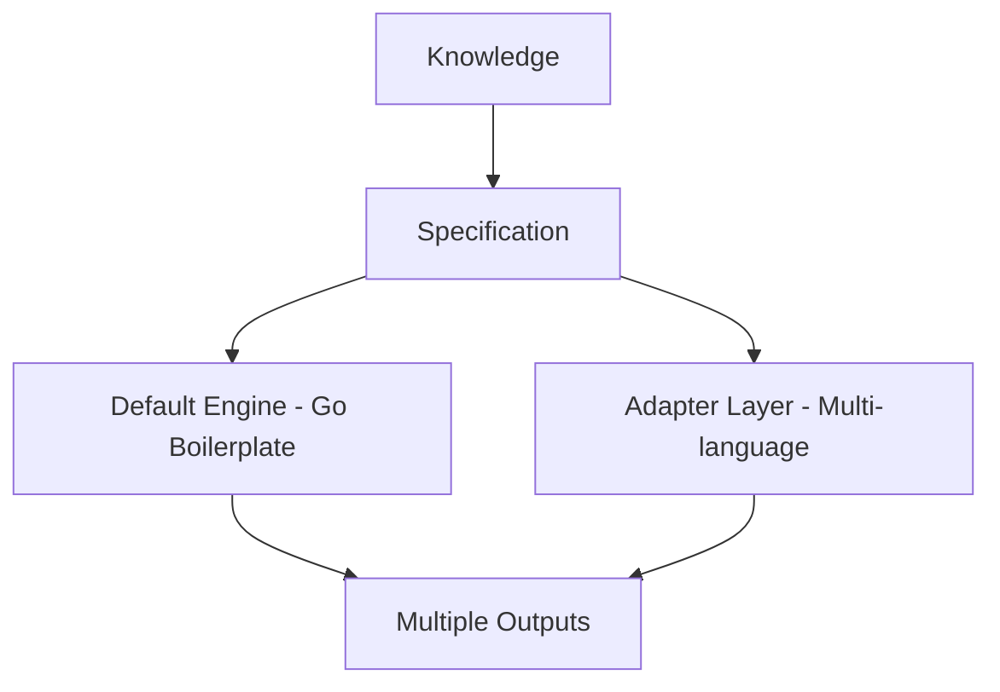
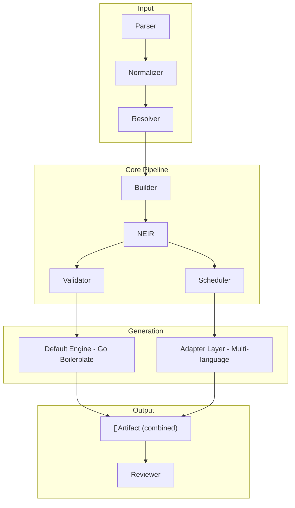

Document ID: NAEOS-SPEC-008

Title: Compiler Model

Short Name: NAEOS Compiler

Version: 1.1.0

Status: Stable

Category: Core Specification

Normative: true

Priority: CRITICAL

Owner: NAEOS Foundation

Depends On:
  - SPEC-001
  - SPEC-002
  - SPEC-003
  - SPEC-004
  - SPEC-005
  - SPEC-006
  - SPEC-007

Referenced By:
  - CLI
  - Studio
  - SDK
  - AI Runtime
  - Compiler Plugins

---

# NAEOS Compiler Model

## Executive Summary

NAEOS Compiler adalah mesin transformasi yang mengubah Engineering Knowledge menjadi berbagai artefak yang dapat digunakan oleh manusia, AI, dan tooling.

Compiler tidak menghasilkan satu output. Compiler menghasilkan banyak target dari satu sumber spesifikasi.

Inilah filosofi utama NAEOS:

> **Specify Once. Build Anywhere.**

Compiler terdiri dari dua lapisan generasi:
1. **Default Engine** — menghasilkan boilerplate Go-centric (README, Dockerfile, CI, go.mod, entry point, module scaffolding)
2. **Adapter Layer** — menghasilkan artefak bahasa spesifik (Go, TypeScript, Python, Java, Rust) via registered OutputAdapters

Kedua lapisan berjalan bersamaan, menghasilkan artefak gabungan yang siap digunakan.

## 1. Purpose

Compiler bertujuan untuk:
- membaca seluruh Artifact
- membangun Engineering Knowledge Graph
- memvalidasi artefak
- mentransformasikan knowledge
- menghasilkan output multi-target
- mendukung generasi kode multi-bahasa

## 2. Compiler Philosophy



```
Knowledge
    │
    ▼
Specification
    │
    ▼
Compiler
    │
    ├──→ Default Engine (Go boilerplate)
    │
    └──→ Adapter Layer (Go, TypeScript, Python, Java, Rust)
            │
            ▼
        Multiple Outputs
```

Compiler bukan translator. Compiler adalah **knowledge transformation engine**.

Dengan adanya Adapter Layer, Compiler menjadi **polyglot generator** — satu spesifikasi menghasilkan artefak dalam banyak bahasa pemrograman secara bersamaan.

## 3. High Level Architecture



```
┌─────────────────────────────────────────────────────────┐
│                    NAEOS Pipeline                        │
│                                                         │
│  ┌──────────┐  ┌──────────┐  ┌──────────┐  ┌────────┐ │
│  │  Parser   │→│Normalizer │→│ Resolver  │→│ Builder│ │
│  └──────────┘  └──────────┘  └──────────┘  └────────┘ │
│                                                     │   │
│                                                     ▼   │
│                                               ┌────────┐│
│                                               │  NEIR  ││
│                                               └────────┘│
│                                                     │   │
│                    ┌────────────────────────────────┤   │
│                    │                                │   │
│              ┌─────▼──────┐              ┌─────────▼──┐│
│              │  Validator  │              │  Scheduler ││
│              └────────────┘              └────────────┘│
│                    │                                │   │
│                    ▼                                ▼   │
│  ┌──────────────────────┐  ┌─────────────────────────┐│
│  │  DefaultEngine       │  │  Adapter Layer          ││
│  │  (Go boilerplate)    │  │  (multi-language)       ││
│  │  - README.md         │  │  - GoAdapter            ││
│  │  - Dockerfile        │  │  - TypeScriptAdapter    ││
│  │  - .github/ci.yml    │  │  - PythonAdapter        ││
│  │  - go.mod            │  │  - JavaAdapter          ││
│  │  - cmd/app/main.go   │  │  - RustAdapter          ││
│  │  - module/*          │  │  - (extensible)         ││
│  │  - service/*         │  │                         ││
│  └──────────┬───────────┘  └────────────┬────────────┘│
│             │                           │              │
│             └───────────┬───────────────┘              │
│                         ▼                              │
│                  ┌─────────────┐                       │
│                  │ []Artifact  │                       │
│                  │ (combined)  │                       │
│                  └─────────────┘                       │
│                         │                              │
│                    ┌────▼─────┐                        │
│                    │ Reviewer │                        │
│                    └──────────┘                        │
└─────────────────────────────────────────────────────────┘
```

## 4. Compilation Pipeline

Tahapan kompilasi:

```
1. Load Repository
       │
       ▼
2. Parse Artifacts (parser.Parser)
       │
       ▼
3. Normalize (normalizer.Normalizer)
       │
       ▼
4. Resolve Dependencies (resolver.Resolver)
       │
       ▼
5. Build NEIR (builder.Builder)
       │
       ▼
6. Validate (validator.Validator)
       │
       ▼
7. Apply Policy Rules (policy.Evaluator)
       │
       ▼
8. Schedule Tasks (scheduler.Scheduler)
       │
       ▼
9. Generate Default Artifacts (engine.DefaultEngine)
       │
       ▼
10. Generate Adapter Artifacts (adapters.GenerateForNEIR)
        │
        ▼
11. Review Artifacts (review.Reviewer)
        │
        ▼
12. Output / Export
```

Pipeline harus deterministik.

## 5. Compiler Components

Compiler terdiri dari komponen berikut:

| Komponen | Package | Tugas |
|----------|---------|-------|
| Parser | `internal/specification/parser` | Membaca YAML/JSON specification |
| Normalizer | `internal/specification/normalizer` | Menormalkan struktur data |
| Resolver | `internal/specification/resolver` | Menyelesaikan dependency dan konteks |
| Builder | `internal/neir/builder` | Membangun NEIR dari resolved spec |
| Validator | `internal/neir/validator` | Memvalidasi NEIR |
| Scheduler | `internal/planner/scheduler` | Menjadwalkan task execution |
| DefaultEngine | `internal/generation/engine` | Menghasilkan Go boilerplate |
| AdapterRegistry | `internal/generation/adapters` | Registry + dispatch multi-language |
| Reviewer | `internal/governance/review` | Review artefak (no TODO, no placeholder) |
| Evaluator | `internal/governance/policy` | Evaluasi policy rules |
| Graph | `internal/planner/graph` | Membangun execution graph |
| Registry | `internal/registry` | Service registry |
| Kernel | `pkg/kernel` | Lifecycle, event bus, telemetry |

## 6. NEIR — Nusantara Enterprise Intermediate Representation

NEIR adalah representasi antara (intermediate representation) yang menjadi satu-satunya format yang dipahami oleh seluruh komponen generator.

### 6.1 NEIR Model Structure

```go
type NEIR struct {
    Project        *project.Project
    Architecture   *architecture.Architecture
    Domain         *domain.Domain
    Modules        []module.Module
    Components     []component.Component
    Services       []service.Service
    APIs           []api.API
    Storage        []storage.Storage
    Infrastructure *infrastructure.Infrastructure
    Security       *security.Security
    AI             *ai.AI
    Documentation  *docs.Documentation
    Deployment     *deployment.Deployment
    Testing        *testingmodel.Testing
    Metadata       *metadata.Metadata
    Generation     *generation.GenerationConfig
}
```

### 6.2 GenerationConfig

```go
type GenerationConfig struct {
    Languages []language.Language   // target languages
    OutputDir string                // output directory override
    ModuleDir string                // module directory override
}
```

GenerationConfig diturunkan dari spec YAML section `generation:` atau di-override via CLI `--language` flag.

### 6.3 Flow

```
Specification YAML
       │
       ▼
   Parser ──→ SpecDocument (with Generation)
       │
       ▼
   Normalizer ──→ NormalizedSpec (with generation map)
       │
       ▼
   Resolver ──→ ResolvedSpec (context["generation"])
       │
       ▼
   Builder ──→ NEIR (with Generation populated)
       │
       ├──→ Validator validates Generation.Languages
       │
       ├──→ DefaultEngine.Generate(NEIR) → Go artifacts
       │
       └──→ adapters.GenerateForNEIR(NEIR) → per-language artifacts
```

## 7. Intermediate Representation

Semua Artifact diterjemahkan menjadi NEIR sebelum diproses oleh generator.

```
YAML Specification
       │
       ▼
   Parser
       │
       ▼
   SpecDocument
       │
       ▼
   NormalizedSpec
       │
       ▼
   ResolvedSpec
       │
       ▼
   NEIR (Intermediate Representation)
       │
       ├──→ DefaultEngine → Go artifacts
       │
       └──→ Adapters → Language-specific artifacts
```

NEIR adalah satu-satunya format yang dipahami oleh seluruh komponen generator.

## 8. Output Targets

Compiler MUST mendukung output berikut:

### 8.1 Documentation
- Markdown
- HTML
- PDF
- Static Website

### 8.2 AI Context
- GitHub Copilot
- Claude Code
- Gemini CLI
- Cursor
- Continue
- Cline
- OpenCode
- OpenAI Codex

### 8.3 Machine Formats
- JSON
- YAML
- JSON Schema
- OpenAPI Extension

### 8.4 Source Code (Multi-Language SDK)

| Language | Build File | Base Image | Runtime Image |
|----------|-----------|------------|---------------|
| Go | `go.mod` | `golang:1.22-alpine` | `alpine:3.19` |
| TypeScript | `package.json` | `node:22-alpine` | `node:22-alpine` |
| Python | `pyproject.toml` | `python:3.12-slim` | `python:3.12-slim` |
| Java | `pom.xml` | `eclipse-temurin:21-jdk-alpine` | `eclipse-temurin:21-jre-alpine` |
| Rust | `Cargo.toml` | `rust:1.78-alpine` | `alpine:3.19` |

### 8.5 Visualization
- Knowledge Graph
- Dependency Graph
- Architecture Diagram
- Traceability Matrix

## 9. Output Adapter Model

### 9.1 Two-Layer Architecture

Compiler menggunakan dua lapisan generasi:

```
         ┌─────────────────────────────────┐
         │         Pipeline.Run()           │
         └───────────────┬─────────────────┘
                         │
         ┌───────────────▼─────────────────┐
         │    DefaultEngine.Generate()      │
         │    (Go-centric boilerplate)      │
         └───────────────┬─────────────────┘
                         │
         ┌───────────────▼─────────────────┐
         │  adapters.GenerateForNEIR()      │
         │  (dispatches to language adapters)│
         └───────────────┬─────────────────┘
                         │
       ┌─────────────────┼─────────────────┐
       │                 │                 │
 ┌─────▼──────┐  ┌──────▼───────┐  ┌──────▼──────┐
 │ GoAdapter  │  │TSAdapter     │  │PyAdapter    │
 │ JavaAdapter│  │RustAdapter   │  │(extensible) │
 └─────┬──────┘  └──────┬───────┘  └──────┬──────┘
       │                │                 │
       └────────────────┼─────────────────┘
                        │
              ┌─────────▼─────────┐
              │  []Artifact        │
              │  (combined output) │
              └───────────────────┘
```

**Layer 1 — Default Engine**: Selalu berjalan. Menghasilkan README.md, Dockerfile, CI workflow, go.mod, cmd/app/main.go, dan scaffolding per-module/per-service dalam Go.

**Layer 2 — Adapter System**: Berjalan ketika `neir.Generation.Languages` terisi. Dispatch ke registered `OutputAdapter` untuk setiap bahasa target. Menghasilkan project files, Dockerfiles, CI workflows, dan module structures yang spesifik per bahasa.

### 9.2 OutputAdapter Interface

```go
type OutputAdapter interface {
    Language() language.Language
    GenerateProject(projectName string) []Artifact
    GenerateModule(moduleName, modulePath, projectName string) []Artifact
    GenerateService(serviceName, serviceKind string, servicePort int, projectName string) []Artifact
    GenerateDockerfile(projectName string) []Artifact
    GenerateCI(projectName string) []Artifact
    GenerateDockerCompose(projectName string) []Artifact
    GenerateArchitectureDoc(projectName, pattern string) []Artifact
}
```

### 9.3 Method Descriptions

| Method | Purpose | Typical Output |
|--------|---------|----------------|
| `Language()` | Returns target language identifier | `language.LanguageGo` |
| `GenerateProject()` | Creates project-level files | Build file + entry point |
| `GenerateModule()` | Creates module source files | Language-appropriate package structure |
| `GenerateService()` | Creates service files | Server implementation with routes |
| `GenerateDockerfile()` | Creates container build file | Language-specific Dockerfile |
| `GenerateCI()` | Creates CI workflow | GitHub Actions with language setup |
| `GenerateDockerCompose()` | Creates compose file | Multi-service orchestration |
| `GenerateArchitectureDoc()` | Creates arch documentation | Pattern-specific markdown |

### 9.4 Adapter Registry

Registry menggunakan package-level map dengan auto-registration via `init()`:

```go
var adapters = map[language.Language]OutputAdapter{}

func Register(adapter OutputAdapter) {
    adapters[adapter.Language()] = adapter
}

func Get(lang language.Language) (OutputAdapter, bool) {
    return adapters[lang]
}
```

### 9.5 Registered Adapters

| Adapter | Language | File | Auto-Registered |
|---------|----------|------|-----------------|
| `GoAdapter` | go | `adapters/go.go` | `init()` |
| `TypeScriptAdapter` | typescript | `adapters/typescript.go` | `init()` |
| `PythonAdapter` | python | `adapters/python.go` | `init()` |
| `JavaAdapter` | java | `adapters/java.go` | `init()` |
| `RustAdapter` | rust | `adapters/rust.go` | `init()` |

### 9.6 Language Resolution

```go
func resolveLanguages(neir *model.NEIR) []language.Language {
    if neir.Generation != nil && len(neir.Generation.Languages) > 0 {
        return neir.Generation.Languages
    }
    return []language.Language{language.LanguageGo} // default
}
```

Jika tidak ada bahasa yang dikonfigurasi, default ke Go. Unknown language di-skip tanpa error.

### 9.7 CLI Override

Flag `--language` pada CLI men-override `neir.Generation.Languages`:

```
naeos run --config config.yaml --input spec.yaml --language go --language typescript
```

Pipeline akan:
1. Load config dari file
2. Parse spec YAML (termasuk `generation:` section)
3. Override `neir.Generation.Languages` dengan CLI values
4. Validasi bahwa semua bahasa valid
5. Generate artefak untuk semua bahasa yang diminta

## 10. Default Engine Detail

Default Engine (`internal/generation/engine/engine.go`) menghasilkan artefak berikut:

### 10.1 Project-Level Artifacts

| Artifact | Path |
|----------|------|
| README | `README.md` |
| Dockerfile | `Dockerfile` |
| CI workflow | `.github/workflows/ci.yml` |
| Go module | `go.mod` |
| Entry point | `cmd/app/main.go` |

### 10.2 Per-Module Artifacts

| Artifact | Path Pattern |
|----------|-------------|
| Module README | `<path>/README.md` |
| Package file | `<path>/package.go` |
| Config | `<path>/config.yaml` |
| Handler | `<path>/handler.go` |
| Repository | `<path>/repository.go` |
| Service | `<path>/service.go` |
| Domain model | `<path>/domain/model.go` |
| HTTP handler | `<path>/http/handler.go` |
| HTTP router | `<path>/http/router.go` |
| Middleware | `<path>/middleware/logging.go` |
| Config struct | `<path>/config/config.go` |
| Config loader | `<path>/config/load.go` |
| Test | `<path>/handler_test.go` |

### 10.3 Per-Service Artifacts

| Artifact | Path Pattern |
|----------|-------------|
| Service config | `internal/<name>/config.yaml` |
| Server (HTTP) | `internal/<name>/server.go` |
| Server test (HTTP) | `internal/<name>/server_test.go` |

### 10.4 Conditional Artifacts

| Condition | Artifact |
|-----------|----------|
| `deployment.strategy` is set | `docker-compose.yml` |
| `architecture.pattern` is set | `docs/architecture.md` |

## 11. Adapter Artifact Detail

### 11.1 Go Adapter Output

| Artifact | Path Pattern |
|----------|-------------|
| Go module | `go.mod` |
| Module package | `<path>/<pkg>.go` |
| Module handler | `<path>/handler.go` |
| Module service | `<path>/service.go` |
| Module repository | `<path>/repository.go` |
| Domain model | `<path>/domain/model.go` |
| HTTP handler | `<path>/http/handler.go` |
| HTTP router | `<path>/http/router.go` |
| Middleware | `<path>/middleware/logging.go` |
| Config | `<path>/config/config.go` |
| Config loader | `<path>/config/load.go` |
| Handler test | `<path>/handler_test.go` |
| Dockerfile | `Dockerfile` |
| CI workflow | `.github/workflows/ci.yml` |
| Service server | `internal/<name>/server.go` |
| Service test | `internal/<name>/server_test.go` |
| Docker Compose | `docker-compose.yml` |
| Architecture doc | `docs/architecture.md` |

### 11.2 TypeScript Adapter Output

| Artifact | Path Pattern |
|----------|-------------|
| Package manifest | `package.json` |
| Module index | `<path>/index.ts` |
| Module types | `<path>/types.ts` |
| Module handler | `<path>/handler.ts` |
| Module service | `<path>/service.ts` |
| Module repository | `<path>/repository.ts` |
| Domain model | `<path>/domain/model.ts` |
| HTTP handler | `<path>/http/handler.ts` |
| HTTP router | `<path>/http/router.ts` |
| Middleware | `<path>/middleware/logging.ts` |
| Config | `<path>/config/config.ts` |
| Config loader | `<path>/config/load.ts` |
| Handler test | `<path>/handler.test.ts` |
| Dockerfile | `Dockerfile` |
| CI workflow | `.github/workflows/ci.yml` |

### 11.3 Python Adapter Output

| Artifact | Path Pattern |
|----------|-------------|
| Package manifest | `pyproject.toml` |
| Module init | `<path>/__init__.py` |
| Module handler | `<path>/handler.py` |
| Module service | `<path>/service.py` |
| Module repository | `<path>/repository.py` |
| Domain model | `<path>/domain/model.py` |
| HTTP handler | `<path>/http/handler.py` |
| HTTP router | `<path>/http/router.py` |
| Middleware | `<path>/middleware/logging.py` |
| Config | `<path>/config/config.py` |
| Config loader | `<path>/config/load.py` |
| Handler test | `<path>/test_handler.py` |
| Dockerfile | `Dockerfile` |
| CI workflow | `.github/workflows/ci.yml` |

### 11.4 Java Adapter Output

| Artifact | Path Pattern |
|----------|-------------|
| Build file | `pom.xml` |
| Module class | `<path>/src/main/java/<pkg>/<Name>.java` |
| Handler | `<path>/src/main/java/<pkg>/Handler.java` |
| Service | `<path>/src/main/java/<pkg>/Service.java` |
| Repository | `<path>/src/main/java/<pkg>/Repository.java` |
| Domain model | `<path>/src/main/java/<pkg>/domain/Model.java` |
| HTTP handler | `<path>/src/main/java/<pkg>/http/Handler.java` |
| HTTP router | `<path>/src/main/java/<pkg>/http/Router.java` |
| Config | `<path>/src/main/java/<pkg>/config/Config.java` |
| Handler test | `<path>/src/test/java/<pkg>/HandlerTest.java` |
| Dockerfile | `Dockerfile` |
| CI workflow | `.github/workflows/ci.yml` |

### 11.5 Rust Adapter Output

| Artifact | Path Pattern |
|----------|-------------|
| Build manifest | `Cargo.toml` |
| Module lib | `<path>/src/lib.rs` |
| Handler | `<path>/src/handler.rs` |
| Service | `<path>/src/service.rs` |
| Repository | `<path>/src/repository.rs` |
| Domain model | `<path>/src/domain/model.rs` |
| HTTP handler | `<path>/src/http/handler.rs` |
| HTTP router | `<path>/src/http/router.rs` |
| Middleware | `<path>/src/middleware/logging.rs` |
| Config | `<path>/src/config/mod.rs` |
| Config loader | `<path>/src/config/load.rs` |
| Handler test | `<path>/src/handler_test.rs` |
| Dockerfile | `Dockerfile` |
| CI workflow | `.github/workflows/ci.yml` |

## 12. Incremental Compilation

Compiler hanya mengompilasi node yang berubah.

Contoh:
```
Standard
    │
    ▼
Backend
    │
    ▼
API
    │
    ▼
Project
```

Jika Backend berubah, node lain yang tidak bergantung padanya tidak dikompilasi ulang.

## 13. Parallel Compilation

Compiler SHOULD mendukung:
- multi-core
- worker pool
- dependency scheduling
- cache

Target: Repository besar tetap dapat dikompilasi dalam waktu singkat.

## 14. Plugin System

Compiler mendukung plugin.

Contoh:
- Markdown Plugin
- Website Plugin
- PDF Plugin
- Copilot Plugin
- Claude Plugin
- Gemini Plugin
- OpenAPI Plugin

Plugin menggunakan API resmi sehingga tidak mengubah Compiler Core.

Menambahkan OutputAdapter baru juga merupakan bentuk plugin — cukup implementasikan `OutputAdapter` interface dan daftarkan via `init()`.

## 15. Compiler API

API inti:

```go
// Pipeline API
pipeline.New(cfg Config) (*Pipeline, error)
pipeline.Run(input string) (*Result, error)
pipeline.Validate(input string) (*Result, error)

// Engine API
engine.Generate(neir any) ([]Artifact, error)
engine.GenerateForLanguage(neir *model.NEIR, lang language.Language) ([]Artifact, error)

// Adapter API
adapters.Register(adapter OutputAdapter)
adapters.Get(lang language.Language) (OutputAdapter, bool)
adapters.GenerateForNEIR(neir *model.NEIR) ([]Artifact, error)
```

Seluruh SDK harus mengimplementasikan kontrak API yang sama.

## 16. AI Integration

Compiler dapat menghasilkan konteks khusus untuk AI.

```
Engineering Knowledge Graph
       │
       ▼
Rule Selection
       │
       ▼
Relevant Standards
       │
       ▼
Prompt Builder
       │
       ▼
AI Context
```

Dengan cara ini, AI menerima konteks yang spesifik, bukan seluruh repository.

## 17. Error Handling

Compiler menghasilkan:
- Error
- Warning
- Suggestion
- Auto Fix (opsional)

Semua pesan harus memiliki:
- kode unik
- deskripsi
- lokasi
- rekomendasi perbaikan

### 17.1 Adapter Error Handling

| Condition | Behavior |
|-----------|----------|
| NEIR is nil | Return nil, no error |
| Unknown language | Skip silently, no artifacts |
| No adapters registered | Default engine output only |
| Invalid language in GenerationConfig | Validation error |

## 18. Performance Requirements

Compiler harus:
- deterministik
- incremental
- paralel
- cache-aware
- extensible
- vendor-neutral

## 19. Security Considerations

Compiler:
- **MUST** memvalidasi seluruh input
- **MUST** menolak Artifact rusak
- **MUST** memverifikasi integritas metadata
- **SHOULD** mendukung artifact signing
- **SHOULD** audit log
- **SHOULD** provenance metadata

## 20. Conformance

Implementasi Compiler dianggap kompatibel jika:
- mendukung seluruh tahapan pipeline
- menggunakan NEIR sebagai intermediate representation
- mendukung DefaultEngine + Adapter Layer
- kompatibel dengan Engineering Knowledge Graph
- lulus seluruh Validation Model
- mendukung minimal Go adapter

## 21. Related Documents

| ID | Document |
|----|----------|
| NAEOS-SPEC-002 | Engineering Knowledge Graph |
| NAEOS-SPEC-003 | Universal Artifact Model |
| NAEOS-SPEC-004 | Metadata Specification |
| NAEOS-SPEC-005 | Rule Model |
| NAEOS-SPEC-006 | Dependency Graph |
| NAEOS-SPEC-007 | Validation Model |
| NES-023-NEIR-Model | NEIR Model Specification |
| NES-039-SDK-MultiLanguage | SDK Multi-Language Specification |
| NES-040-Output-Adapter-Architecture | Output Adapter Architecture |

## Revision History

| Version | Date | Change |
|---------|------|--------|
| 1.0.0 | 2026-07-09 | Initial Compiler Model |
| 1.1.0 | 2026-07-10 | Added NEIR model, Adapter Layer, multi-language SDK architecture, adapter detail per language |

---

**Status**
NAEOS-SPEC-008

APPROVED

Compiler Core Established
