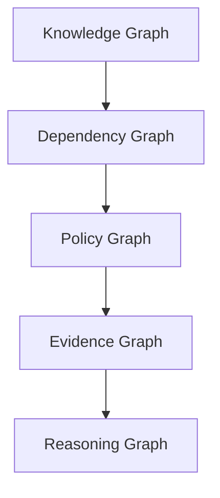
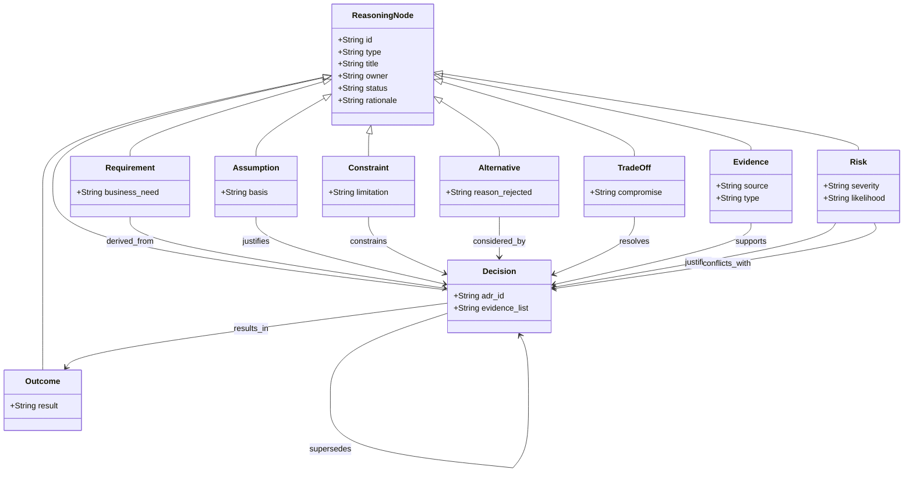

Document ID: NAEOS-SPEC-009

Title: Engineering Reasoning Graph

Short Name: ERG

Version: 1.1.0

Status: Stable

Category: Core Specification

Normative: true

Priority: CRITICAL

Owner: NAEOS Foundation

Depends On:
  - SPEC-001
  - SPEC-002
  - SPEC-005

Referenced By:
  - Compiler
  - Validator
  - AI Runtime
  - SDK

Motto:
"Every Decision Has a Reason."

---

# Engineering Reasoning Graph

## Executive Summary

Engineering Reasoning Graph (ERG) adalah model yang merepresentasikan alasan di balik keputusan engineering.

ERG menghubungkan Requirement, Architecture Decision, Policy, Evidence, Risk, dan Outcome sehingga AI maupun engineer dapat menelusuri mengapa suatu keputusan dibuat.

## 1. Purpose

ERG bertujuan untuk:

- merekam alasan di balik setiap keputusan engineering,
- memungkinkan traceability dari requirement ke bukti,
- mendukung AI reasoning yang dapat menjelaskan justifikasi,
- memperkuat governance melalui decision auditability.

## 2. Core Concept

NAEOS memiliki empat graph inti:



```
Knowledge Graph
        │
        ▼
Dependency Graph
        │
        ▼
Policy Graph
        │
        ▼
Evidence Graph
        │
        ▼
Reasoning Graph
```

Reasoning Graph berada di atas graph lainnya karena memanfaatkan seluruh informasi tersebut.

## 3. Reasoning Node

Setiap node dapat berupa:

| Node Type | Description |
|-----------|-------------|
| Requirement | Kebutuhan bisnis atau teknis |
| Assumption | Asumsi yang mendasari keputusan |
| Constraint | Keterbatasan yang harus dipenuhi |
| Risk | Risiko yang teridentifikasi |
| Decision | Keputusan yang diambil (ADR) |
| Alternative | Opsi yang dipertimbangkan |
| Trade-off | Kompromi yang dibuat |
| Evidence | Bukti yang mendukung keputusan |
| Outcome | Hasil dari implementasi |

### 3.1 Node Schema

```yaml
reasoning_node:
  id: RNG-001
  type: Decision
  title: Use Event Bus Architecture
  owner: Architecture Team
  status: Accepted
  rationale: Decouple services for scalability
  evidence:
    - prototype-benchmark
    - load-test-results
  alternatives:
    - direct-http
    - message-queue
  risk_level: Medium
  created_at: 2026-07-09
  superseded_by: null
```

### 3.2 Node Lifecycle

```
Proposed
    │
    ▼
Under Review
    │
    ▼
Accepted / Rejected
    │
    ▼
Implemented
    │
    ▼
Evidence Collected
    │
    ▼
Superseded (optional)
```

## 4. Relationship Types



Hubungan yang didukung:

| Relationship | From → To | Description |
|-------------|-----------|-------------|
| `supports` | Evidence → Decision | Bukti mendukung keputusan |
| `justifies` | Risk → Decision | Risiko membenarkan keputusan |
| `depends_on` | Decision → Decision | Keputusan bergantung pada keputusan lain |
| `conflicts_with` | Decision → Decision | Dua keputusan saling bertentangan |
| `supersedes` | Decision → Decision | Keputusan baru menggantikan yang lama |
| `mitigates` | Mitigation → Risk | Tindakan mengurangi risiko |
| `causes` | Event → Risk | Peristiwa menyebabkan risiko |
| `results_in` | Decision → Outcome | Keputusan menghasilkan outcome |
| `derived_from` | Requirement → Intent | Requirement diturunkan dari intent |

## 5. Example Flow

```
Requirement
      │
      ▼
Decision
      │
      ▼
Policy
      │
      ▼
Evidence
      │
      ▼
Outcome
```

### 5.1 Concrete Example

```
Business Need: Support 10,000 concurrent users
      │
      ▼
ADR-012: Use Event Bus for inter-service communication
      │
      ├──→ Alternative considered: Direct HTTP (rejected: tight coupling)
      ├──→ Alternative considered: Message Queue (deferred: complexity)
      │
      ▼
Policy: All new services MUST use event bus
      │
      ▼
Evidence: Load test shows 15,000 concurrent users achieved
      │
      ▼
Outcome: System scales to required capacity
```

## 6. AI Integration

AI tidak hanya mengambil konteks, tetapi juga jalur penalaran.

### 6.1 AI Reasoning Flow

```
Question
      │
      ▼
Knowledge Graph
      │
      ▼
Reasoning Graph
      │
      ▼
Evidence Graph
      │
      ▼
Policy Graph
      │
      ▼
Answer + Justification
```

Dengan demikian AI dapat menjelaskan:

- aturan yang digunakan,
- keputusan yang diambil,
- bukti yang mendukung,
- alternatif yang dipertimbangkan.

### 6.2 AI-Generated Reasoning Reports

AI dapat menghasilkan laporan penalaran dari Reasoning Graph:

```yaml
reasoning_report:
  query: "Why was event bus chosen?"
  decision: ADR-012
  rationale: Scalability requirement
  evidence:
    - load-test-report-001
    - benchmark-comparison-002
  alternatives_evaluated:
    - alternative: Direct HTTP
      reason_rejected: Tight coupling
    - alternative: Message Queue
      reason_deferred: Operational complexity
  confidence: High
```

## 7. Architectural Decision Records (ADR)

Setiap ADR menjadi bagian dari Reasoning Graph.

### 7.1 ADR Structure

```yaml
adr:
  id: ADR-001
  title: Use REST API for Public Endpoints
  status: Accepted
  date: 2026-07-09
  context: Need public-facing API
  decision: Use REST over GraphQL
  consequences:
    positive: Simpler tooling
    negative: Less flexible queries
  alternatives:
    - GraphQL: Rejected due to team expertise
    - gRPC: Rejected due to browser limitations
```

### 7.2 ADR Relationships

```
Requirement
      │
      ▼
ADR
      │
      ▼
Implementation
      │
      ▼
Evidence
```

## 8. Risk Reasoning

Graph juga dapat menghubungkan:

```
Threat
      │
      ▼
Risk
      │
      ▼
Mitigation
      │
      ▼
Evidence
```

Ini memperkuat integrasi dengan Security Constitution.

### 8.1 Risk Mitigation Chain

```yaml
risk_reasoning:
  threat: SQL Injection
  risk:
    id: RISK-007
    severity: Critical
    likelihood: High
  mitigation:
    id: MIT-003
    action: Parameterized queries only
    policy: SEC-STD-004
  evidence:
    - penetration-test-report
    - static-analysis-scan
  residual_risk: Low
```

## 9. Evolution

Ketika keputusan berubah:

```
ADR-001
      │
 superseded_by
      ▼
ADR-014
```

Riwayat penalaran tetap terjaga.

### 9.1 Decision Supersession

```yaml
supersession:
  old_decision: ADR-001
  new_decision: ADR-014
  reason: Performance requirements increased
  evidence: Load test failure at 5,000 users
  preserved: true  # historical record maintained
```

## 10. Compiler Support

Compiler dapat menghasilkan:

- Decision Reports
- Architecture Rationale
- Compliance Justification
- AI Context Bundle
- Executive Summary

berdasarkan Reasoning Graph.

### 10.1 Adapter-Aware Reasoning

Ketika compiler menghasilkan artefak multi-bahasa, ERG dapat melacak keputusan di balik pemilihan adapter:

```yaml
adapter_reasoning:
  decision: ADR-020
  title: Use TypeScript for Frontend SDK
  requirement: Frontend team expertise
  evidence: Team proficiency survey
  alternatives:
    - Go: Rejected, frontend team unfamiliar
    - Rust: Rejected, learning curve too steep
  outcome: TypeScript adapter chosen
```

## 11. Validation

Validator memeriksa:

- keputusan tanpa evidence,
- evidence tanpa decision,
- requirement tanpa rationale,
- risiko tanpa mitigasi.

### 11.1 Validation Rules

| Rule | Condition | Severity |
|------|-----------|----------|
| ERG-001 | Every Decision MUST have at least one Evidence | Warning |
| ERG-002 | Every Risk MUST have at least one Mitigation | Error |
| ERG-003 | Every Requirement MUST have rationale | Warning |
| ERG-004 | Every Superseded decision MUST reference replacement | Error |
| ERG-005 | Reasoning Graph MUST NOT have orphan nodes | Warning |

## 12. Conformance

Implementasi dianggap sesuai apabila:

- keputusan penting memiliki rationale,
- rationale memiliki evidence,
- perubahan keputusan terdokumentasi,
- graph dapat ditelusuri.

## 13. Related Documents

| ID | Document |
|----|----------|
| NAEOS-SPEC-001 | Overview |
| NAEOS-SPEC-002 | Engineering Knowledge Graph |
| NAEOS-SPEC-005 | Rule Model |
| NES-039 | SDK Multi-Language Specification |

## Revision History

| Version | Date | Change |
|---------|------|--------|
| 1.0.0 | 2026-07-09 | Initial Engineering Reasoning Graph |
| 1.1.0 | 2026-07-10 | Added Purpose section, expanded Node Schema, Relationship table, Validation Rules, Adapter-Aware Reasoning, concrete examples |

---

**Status**
NAEOS-SPEC-009

APPROVED

Engineering Reasoning Graph Established
