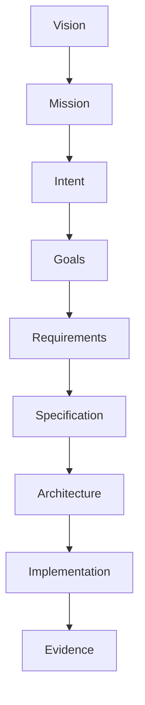

Document ID: NAEOS-SPEC-010

Title: Intent Model

Short Name: NIM

Version: 1.1.0

Status: Stable

Category: Core Specification

Normative: true

Priority: CRITICAL

Owner: NAEOS Foundation

Depends On:
  - SPEC-001
  - SPEC-002
  - SPEC-009

Referenced By:
  - Compiler
  - Validator
  - AI Runtime
  - SDK

Motto:
"Every System Begins with Intent."

---

# Intent Model

## Executive Summary

Intent Model mendefinisikan bagaimana tujuan bisnis, kebutuhan pengguna, visi produk, dan sasaran organisasi direpresentasikan sebagai artefak formal.

Intent menjadi titik awal seluruh siklus engineering di NAEOS.

## 1. Purpose

Intent Model bertujuan untuk:

- mendefinisikan tujuan engineering secara eksplisit dan formal,
- memastikan semua keputusan teknis dapat ditelusuri kembali ke intent bisnis,
- memungkinkan AI membantu sejak tahap paling awal (bukan hanya saat implementasi),
- menyediakan dasar bagi reasoning graph dan compliance engine.

## 2. Intent Lifecycle



```
Vision
    │
    ▼
Mission
    │
    ▼
Intent
    │
    ▼
Goals
    │
    ▼
Requirements
    │
    ▼
Specification
    │
    ▼
Architecture
    │
    ▼
Implementation
    │
    ▼
Evidence
```

Dengan demikian, tidak ada lagi "loncatan" dari ide langsung ke requirement.

## 3. Intent Types

Contoh kategori intent:

| Type | Description | Example |
|------|-------------|---------|
| Business Intent | Tujuan bisnis | "Expand to Southeast Asian market" |
| Product Intent | Tujuan produk | "Achieve 99.9% uptime" |
| Technical Intent | Tujuan teknis | "Migrate to microservices" |
| Security Intent | Tujuan keamanan | "Zero-trust architecture" |
| Compliance Intent | Tujuan kepatuhan | "GDPR compliance" |
| AI Intent | Tujuan AI | "Automate code review" |
| Operational Intent | Tujuan operasional | "Reduce deployment time to < 5 minutes" |
| Research Intent | Tujuan riseks | "Evaluate Rust for performance-critical modules" |

## 4. Intent Schema

```yaml
intent:
  id: INT-001
  title: Build AI SaaS Platform
  type: Business Intent
  owner: Product Team
  priority: High
  status: Proposed
  rationale: Expand business automation market
  vision_ref: VSN-001
  mission_ref: MSI-001
  goals:
    - goal_id: GOAL-001
      title: Launch MVP in 6 months
      metrics:
        - 100 beta users
        - 5 API integrations
    - goal_id: GOAL-002
      title: Achieve $50K MRR
      metrics:
        - MRR growth 20% MoM
  risks:
    - risk_id: RISK-001
      description: Market competition
      mitigation: MIT-001
  created_at: 2026-07-09
  updated_at: 2026-07-09
```

## 5. Goal Mapping

Satu Intent dapat menghasilkan banyak Goal.

```
Intent
   │
   ├── Goal A
   ├── Goal B
   └── Goal C
```

### 5.1 Goal Schema

```yaml
goal:
  id: GOAL-001
  title: Launch MVP in 6 months
  intent_ref: INT-001
  owner: Engineering Team
  status: Active
  priority: Critical
  metrics:
    - metric: "100 beta users"
      target: 2026-12-31
    - metric: "5 API integrations"
      target: 2026-12-31
  requirements:
    - REQ-001
    - REQ-002
    - REQ-003
```

## 6. Requirement Derivation

Requirement diturunkan dari Goal.

```
Intent
    │
    ▼
Goals
    │
    ▼
Requirements
```

Compiler dapat memeriksa apakah Requirement masih sesuai dengan Intent awal.

### 6.1 Traceability

```
INT-001 (Business Intent)
    │
    ▼
GOAL-001 (Launch MVP)
    │
    ├──→ REQ-001 (User Authentication)
    ├──→ REQ-002 (API Gateway)
    └──→ REQ-003 (Payment Integration)
         │
         ├──→ SPEC-010 (Auth Specification)
         ├──→ SPEC-011 (API Gateway Spec)
         └──→ SPEC-012 (Payment Spec)
              │
              ├──→ Go Adapter → Go source code
              ├──→ TS Adapter → TypeScript source code
              └──→ Python Adapter → Python source code
```

Traceability dari Intent sampai ke artefak output adapter.

## 7. AI Integration

AI dapat membantu:

- memperjelas Intent,
- menemukan ambiguitas,
- mengusulkan Goal,
- menyusun Requirement,
- mengidentifikasi risiko.

Dengan demikian AI bekerja mulai dari tahap paling awal, bukan hanya saat implementasi.

### 7.1 AI-Assisted Intent Refinement

```yaml
ai_suggestion:
  intent: INT-001
  suggestion: "Consider adding scalability goal"
  rationale: "Market research shows 3x growth expected"
  proposed_goal:
    title: Support 10,000 concurrent users
    metrics:
      - metric: "10K concurrent users"
        target: 2027-06-30
  confidence: High
  source: market-research-report
```

### 7.2 AI Validation of Intent-Implementation Alignment

AI dapat memeriksa apakah implementasi masih selaras dengan intent:

```
Intent: Build AI SaaS Platform
    │
    ▼
AI Analysis
    │
    ├──→ Check: Does code match intent?
    ├──→ Check: Are requirements still relevant?
    ├──→ Check: Are there scope creep indicators?
    └──→ Check: Are metrics being tracked?
    │
    ▼
Alignment Report
```

## 8. Validation

Validator memeriksa:

- Intent tanpa Goal,
- Goal tanpa Requirement,
- Requirement yang tidak mendukung Intent,
- Intent yang bertentangan.

### 8.1 Validation Rules

| Rule | Condition | Severity |
|------|-----------|----------|
| INT-001 | Every Intent MUST have at least one Goal | Error |
| INT-002 | Every Goal MUST have at least one Requirement | Error |
| INT-003 | Every Requirement MUST trace back to an Intent | Warning |
| INT-004 | Intent MUST NOT have conflicting priorities | Error |
| INT-005 | Superseded Intent MUST reference replacement | Warning |
| INT-006 | Intent without metrics SHOULD have rationale | Info |

## 9. Unified Engineering Lifecycle

Dengan Intent, siklus NAEOS menjadi lengkap:

```
Intent
    │
    ▼
Knowledge
    │
    ▼
Policy
    │
    ▼
Architecture
    │
    ▼
Implementation
    │
    ▼
Evidence
    │
    ▼
Reasoning
    │
    ▼
Continuous Improvement
```

### 9.1 Unified Engineering Graph 2.0

```
                Unified Engineering Graph

                            │

     ┌──────────┬──────────┬──────────┬──────────┬──────────┐
     ▼          ▼          ▼          ▼          ▼
  Intent    Knowledge   Policy    Evidence   Reasoning
    │
    └───────────────────────────────┐
                                    ▼
                           Engineering Intelligence
```

Intent menjadi fondasi seluruh Engineering Intelligence.

## 10. Conformance

Implementasi Intent Model MUST:

- mendefinisikan Intent sebagai artefak formal,
- mendukung Goal-Requirement traceability,
- memvalidasi Intent-Google-Requirement alignment,
- mendukung AI-assisted intent refinement.

## 11. Related Documents

| ID | Document |
|----|----------|
| NAEOS-SPEC-001 | Overview |
| NAEOS-SPEC-002 | Engineering Knowledge Graph |
| NAEOS-SPEC-009 | Engineering Reasoning Graph |
| NES-039 | SDK Multi-Language Specification |

## Revision History

| Version | Date | Change |
|---------|------|--------|
| 1.0.0 | 2026-07-09 | Initial Intent Model |
| 1.1.0 | 2026-07-10 | Added Purpose section, expanded Intent Schema, added Goal Schema, added traceability chain to adapter output, added AI validation, added Validation Rules table |

---

**Status**
NAEOS-SPEC-010

APPROVED

Intent Model Established
